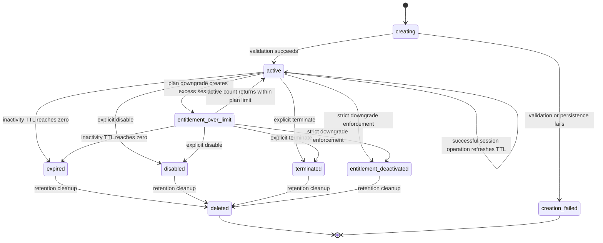

# Session Lifecycle

## 1. Purpose

This document defines the lifecycle of a MemoryRepo session.

A session is a user-owned, temporary working-memory container. It holds active context for LLM agents, MCP clients, LangChain workflows, coding assistants, and related tools.

The initial session inactivity timeout is:

```text
3 hours = 10,800 seconds
```

A session uses sliding expiration. Every successful eligible session operation refreshes its inactivity timer.

---

## 2. Session goals

A session must provide:

- Temporary isolated working memory for one authenticated user.
- Configurable parallel-session capacity based on plan entitlement.
- Low-latency access for repeated MCP and agent calls.
- Strict ownership validation.
- Automatic cleanup after inactivity.
- Durable lifecycle metadata for audit and operational analysis.
- Safe behavior under concurrent create-session and memory-operation requests.

---

## 3. Session states

MemoryRepo must support the following logical session states.

| State | Meaning | Counts toward active-session limit? |
|---|---|---:|
| `active` | Session is valid, enabled, and not expired. | Yes |
| `expiring` | Optional transitional state used during cleanup or expiration processing. | No |
| `expired` | Inactivity timeout elapsed. | No |
| `disabled` | Explicitly disabled by user or administrator. | No |
| `terminated` | Explicitly ended by the user or system. | No |
| `deleted` | Permanently removed or scheduled for final deletion. | No |
| `entitlement_over_limit` | Existing session remains usable after downgrade, but user cannot create new sessions until within limit. | Yes |
| `entitlement_deactivated` | Session disabled because strict entitlement enforcement was applied. | No |
| `creation_failed` | Session creation did not complete successfully. This is an audit-only state. | No |

The initial MVP may store only `active`, `expired`, `disabled`, `terminated`, and `entitlement_deactivated` as durable states. The others should remain available in the lifecycle model.

---

## 4. State transition rules



---

## 5. Session identity

Each session must have a globally unique identifier.

Recommended format:

```text
sess_<ULID>
```

Example:

```text
sess_01JZ7B5RXNQ76Y8G6F4E3AZ7QJ
```

A session identifier must not encode sensitive user information.

---

## 6. Session ownership

Every session belongs to exactly one authenticated user.

The system must enforce:

```text
authenticated_user_id == session.owner_user_id
```

before allowing:

- Session status access.
- Add context.
- Get context.
- Remove context.
- Compact context.
- Disable session.
- Terminate session.
- Read debug retrieval metadata.
- Read session audit information.

The API must not rely on a client-provided `user_id` for authorization.

---

## 7. Session creation

## 7.1 Create-or-get operation

The primary session entry point is:

```text
create_or_get_session()
```

This operation must support two modes:

| Mode | Behavior |
|---|---|
| `reuse_existing` | Return an existing active session if one exists. |
| `create_new` | Create a new active session only if plan limits allow. |

The default mode must be:

```text
reuse_existing
```

This reduces accidental creation of multiple sessions by frequently called MCP clients.

---

## 7.2 Create-or-get algorithm

```text
1. Authenticate the caller.
2. Resolve effective entitlement.
3. Find user-owned active sessions.
4. If mode is reuse_existing:
      a. Return the most recently active eligible session.
      b. If no active session exists, create one.
5. If mode is create_new:
      a. Count active sessions.
      b. Compare count with max_active_sessions.
      c. Reject if limit reached.
      d. Otherwise create a new session.
6. Store active session metadata in hot storage.
7. Persist durable session metadata.
8. Return session details.
```

---

## 7.3 Session creation idempotency

Session creation must support idempotency.

A client must be able to supply:

```text
Idempotency-Key: <unique client-generated key>
```

For repeated requests using the same user identity and idempotency key:

- Return the original successful response.
- Do not create a second session.
- Do not increment active session count twice.
- Do not create duplicate audit events.

The idempotency record should expire after a configurable retention period.

Initial recommendation:

```text
24 hours
```

---

## 7.4 Concurrent session creation

The system must remain correct when multiple create-session requests occur simultaneously.

Example risk:

```text
Free plan limit = 1
Two browser tabs call create_new at nearly the same time
Both see 0 active sessions
Both create sessions
User now has 2 sessions
```

This must be prevented.

### Required control

Session creation must use an atomic guard.

Recommended hot-store pattern:

```text
user:{user_id}:active_session_count
```

Creation sequence:

```text
1. Atomically increment candidate active session count only if below limit.
2. Create session metadata.
3. If creation fails, decrement count in compensation logic.
4. Persist durable metadata.
5. Return session.
```

A Lua script or equivalent atomic Valkey transaction should enforce the limit check and counter increment as one operation.

Durable storage must reconcile the counter if failures occur after the hot-store mutation.

---

## 8. Session storage model

A session has two representations.

### 8.1 Hot session state

Stored in Valkey for fast access.

Suggested key:

```text
session:{user_id}:{session_id}:meta
```

Suggested fields:

| Field | Purpose |
|---|---|
| `session_id` | Session identifier. |
| `owner_user_id` | Authenticated owner. |
| `state` | Current active lifecycle state. |
| `created_at` | Creation time. |
| `last_activity_at` | Last successful eligible operation time. |
| `expires_at` | Expected expiration time. |
| `token_budget` | Session context token limit. |
| `token_usage` | Current stored context token total. |
| `memory_item_count` | Current memory count. |
| `plan_key` | Effective plan at creation. |
| `plan_version` | Entitlement configuration version. |
| `entitlement_snapshot` | Policy values used by session. |
| `tree_version` | Current PageIndex tree version if available. |
| `memory_version` | Incremented when memory changes. |

The metadata key must have the session TTL.

### 8.2 Durable session record

Stored in DynamoDB.

The durable record must preserve:

- Session ID.
- User ID.
- Creation time.
- Last known activity time.
- State transitions.
- Entitlement snapshot.
- Disablement or termination reason.
- Expiration event.
- Token usage snapshots where useful.
- Audit correlations.
- Cleanup retention metadata.

Durable storage is not the primary source for real-time expiry enforcement.

---

## 9. Sliding TTL behavior

## 9.1 Refresh conditions

The session TTL must refresh after successful authorized operations:

- `get_session_status`
- `add_context`
- `get_context`
- `remove_context`
- `compact_context`
- `disable_session` only if the system needs to retain temporary state for the operation

The session TTL must not refresh for:

- Authentication failures.
- Invalid session IDs.
- Unauthorized session access attempts.
- Invalid request payloads.
- Requests rejected due to entitlement limits.
- Requests rejected because the session is expired, disabled, or terminated.
- Background jobs that do not represent user activity.

## 9.2 Refresh algorithm

On successful eligible operation:

```text
1. Confirm session exists.
2. Confirm session state is eligible.
3. Confirm caller owns session.
4. Perform requested operation.
5. Set TTL of all active session keys to inactivity_timeout_seconds.
6. Update last_activity_at.
7. Update expires_at.
```

The key refresh must be atomic with or immediately adjacent to the state mutation.

---

## 10. Session expiry

## 10.1 Expiry source of truth

The hot-store TTL is the source of truth for active-session expiry.

When the TTL reaches zero:

- Active session keys disappear from Valkey.
- Context is no longer available through the hot path.
- The session must be treated as expired.
- Later requests must not recreate the same session implicitly.

## 10.2 Expired-session response

If a client references an expired session ID, return:

```json
{
  "error": {
    "code": "SESSION_EXPIRED",
    "message": "The session expired after inactivity.",
    "details": {
      "session_id": "sess_...",
      "inactivity_timeout_seconds": 10800
    }
  }
}
```

The API may include guidance that the client should call `create_or_get_session`.

## 10.3 Expiry audit

After hot-store expiration, a background reconciliation job should update the durable session record:

```text
state = expired
expired_at = timestamp
reason = inactivity_timeout
```

The reconciliation job is operationally useful but must not be relied on to enforce expiry.

---

## 11. Explicit session disablement

A session may be disabled by:

- The user.
- An administrator.
- A security workflow.
- A strict entitlement downgrade.
- An abuse-prevention workflow.

When disabled:

1. Remove or invalidate hot access.
2. Prevent new context operations.
3. Record a durable state transition.
4. Record actor and reason.
5. Preserve session audit information according to retention policy.

Disabled-session error:

```json
{
  "error": {
    "code": "SESSION_DISABLED",
    "message": "The session is disabled.",
    "details": {
      "session_id": "sess_...",
      "reason": "user_requested"
    }
  }
}
```

---

## 12. Session termination

Termination is an explicit user or system action.

Termination differs from expiry:

| Aspect | Expiry | Termination |
|---|---|---|
| Trigger | Inactivity timeout | Explicit request |
| Hot store | TTL removes data | Service removes or invalidates keys |
| User intent | No explicit action | User or system requested end |
| Durable state | `expired` | `terminated` |
| Reuse | Must create new session | Must create new session |

Termination must not silently become deletion. Retention policy determines when durable records are deleted.

---

## 13. Entitlement downgrade interaction

When a plan downgrade causes active-session count to exceed the new limit:

### Default non-destructive policy

1. Keep current active sessions available until normal expiry.
2. Mark user entitlement as over limit.
3. Prevent creation of additional sessions.
4. Allow user to terminate sessions voluntarily.
5. Resume normal creation once active session count is within the new limit.

### Strict policy

1. Rank sessions by `last_activity_at`.
2. Keep the newest sessions up to the new limit.
3. Disable the rest.
4. Write audit events.
5. Return `SESSION_ENTITLEMENT_DEACTIVATED` for affected sessions.

---

## 14. Session activity definition

An action counts as meaningful activity only when:

- It is authenticated.
- It is authorized.
- It is valid.
- It successfully operates on an active session.

Examples:

| Operation | Refreshes TTL? |
|---|---:|
| Valid `get_context` | Yes |
| Valid `add_context` | Yes |
| Invalid JSON payload | No |
| Unauthorized request | No |
| Query to another user’s session | No |
| Failed compaction job | No |
| Background PageIndex rebuild | No |
| Polling a non-existent session | No |

---

## 15. Session cleanup

Cleanup has two layers.

### 15.1 Hot-store cleanup

Valkey TTL removes:

- Session metadata.
- Session memory items.
- Session vector-index entries where key namespace permits.
- Session-local idempotency state.
- Session-local locks.

### 15.2 Durable cleanup

A scheduled retention job may later delete or archive:

- Durable session metadata.
- Audit detail.
- S3 PageIndex artifacts.
- Long-form source documents.
- Compaction job records.

Retention windows must be defined in the privacy and retention document.

---

## 16. Session lifecycle observability

The system must emit metrics for:

- Active session count.
- Sessions created.
- Sessions expired.
- Sessions disabled.
- Sessions terminated.
- Session-limit rejection count.
- Entitlement-over-limit user count.
- Average session lifetime.
- Average time between user operations.
- Hot-store TTL refresh failures.
- Session creation race-condition conflicts.

The system must emit structured events for every state transition.

Example event:

```json
{
  "event_type": "session.expired",
  "session_id": "sess_...",
  "user_id": "usr_...",
  "previous_state": "active",
  "new_state": "expired",
  "reason": "inactivity_timeout",
  "occurred_at": "2026-06-23T18:30:00Z",
  "correlation_id": "req_..."
}
```

---

## 17. Acceptance criteria

This document is satisfied when all of the following can be demonstrated:

1. A new user with no active session receives one session through `create_or_get_session`.
2. Repeated `reuse_existing` calls return the same active session.
3. Explicit `create_new` requests are blocked when plan limits are reached.
4. Concurrent create-session requests cannot exceed the user’s active-session limit.
5. Session TTL refreshes after valid memory operations.
6. Invalid or unauthorized requests do not refresh TTL.
7. An expired session cannot be used for memory operations.
8. A disabled session cannot be used for memory operations.
9. Session state transitions are durably recorded.
10. Session expiration is enforced by hot-store TTL rather than delayed durable cleanup.
11. Downgrades follow the configured non-destructive or strict policy.
12. Session status returns the required lifecycle and usage fields.
