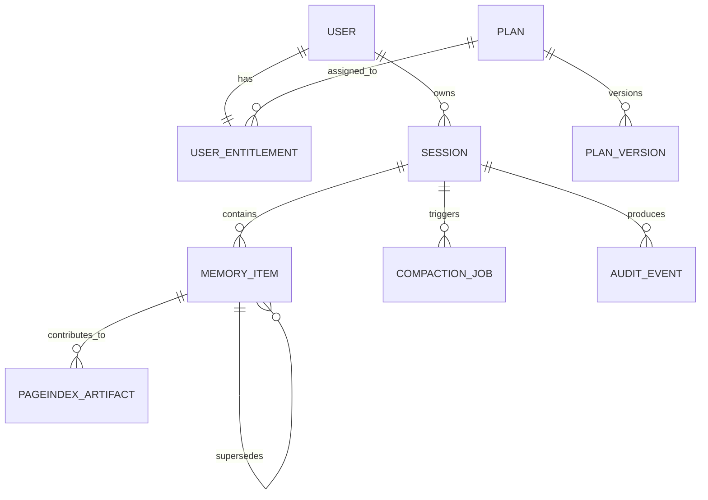

# Data Model

## 1. Purpose

This document defines the data model for MemoryRepo.

MemoryRepo uses different storage layers for different responsibilities:

| Storage layer | AWS service | Primary purpose |
|---|---|---|
| Hot session store | Amazon ElastiCache for Valkey | Low-latency active sessions, context items, token counters, locks, and session-local vector retrieval. |
| Durable operational store | Amazon DynamoDB | Users, plans, entitlements, durable session metadata, idempotency records, audit events, and background-job status. |
| Object storage | Amazon S3 | PageIndex trees, long-form source artifacts, evaluation sets, model artifacts, and retained compaction outputs. |

The design separates strict real-time session expiry from durable audit and configuration data.

---

## 2. Data ownership model

Every user-owned record must be scoped by:

```text
owner_user_id
```

Every session-scoped record must be scoped by:

```text
owner_user_id
session_id
```

Every memory item must be scoped by:

```text
owner_user_id
session_id
memory_id
```

No query path may retrieve session or memory data without an authenticated user boundary.

---

## 3. Entity overview



---

## 4. DynamoDB table strategy

The first production-oriented design uses separate DynamoDB tables by access pattern and retention behavior.

| Table | Purpose |
|---|---|
| `memoryrepo-users` | Durable user profile and account state. |
| `memoryrepo-plans` | Plan definitions and plan versions. |
| `memoryrepo-entitlements` | User-to-plan assignments and overrides. |
| `memoryrepo-sessions` | Durable session metadata and lifecycle state. |
| `memoryrepo-idempotency` | Idempotency records for session creation and memory add. |
| `memoryrepo-audit-events` | Security, entitlement, session, and administration audit events. |
| `memoryrepo-jobs` | Background compaction, PageIndex, and repair job state. |

A future optimization may consolidate low-volume tables into a single-table design. The initial implementation should favor clear access patterns over premature DynamoDB complexity.

---

# 5. Users table

## 5.1 Table name

```text
memoryrepo-users
```

## 5.2 Primary key

```text
PK = user_id
```

## 5.3 Required attributes

| Attribute | Type | Description |
|---|---|---|
| `user_id` | String | Stable identity derived from Cognito subject or mapped internal identity. |
| `identity_provider` | String | Identity source, initially Cognito. |
| `status` | String | `active`, `suspended`, `deleted`, or `pending`. |
| `created_at` | String | ISO 8601 timestamp. |
| `updated_at` | String | ISO 8601 timestamp. |
| `default_plan_key` | String | Fallback plan indicator for diagnostics. |
| `profile_version` | Number | Optimistic update version. |

## 5.4 Optional attributes

| Attribute | Type | Description |
|---|---|---|
| `display_name` | String | Optional user display name. |
| `organization_id` | String | Future multi-tenant organization support. |
| `metadata` | Map | Non-sensitive application metadata. |
| `deleted_at` | String | Soft-delete timestamp. |

## 5.5 Access patterns

| Access pattern | Key |
|---|---|
| Load user by authenticated identity | `user_id` |
| Validate user state | `user_id` |
| Update suspension state | `user_id` |

---

# 6. Plans table

## 6.1 Table name

```text
memoryrepo-plans
```

## 6.2 Primary key

```text
PK = plan_id
SK = version
```

## 6.3 Required attributes

| Attribute | Type | Description |
|---|---|---|
| `plan_id` | String | Stable plan identifier. |
| `version` | Number | Immutable plan version. |
| `plan_key` | String | Machine-readable plan label, such as `free`. |
| `display_name` | String | User-visible plan label. |
| `is_active` | Boolean | Whether assignment to this plan is allowed. |
| `max_active_sessions` | Number | Maximum concurrent active sessions. |
| `session_token_budget` | Number | Maximum total session context tokens. |
| `max_context_items_per_session` | Number | Maximum context-item count. |
| `max_add_request_tokens` | Number | Maximum token count for a single add request. |
| `max_retrieval_top_k` | Number | Maximum retrieval count. |
| `api_requests_per_minute` | Number | REST rate limit. |
| `mcp_requests_per_minute` | Number | MCP rate limit. |
| `enable_reranking` | Boolean | Feature flag. |
| `enable_pageindex_retrieval` | Boolean | Feature flag. |
| `enable_manual_compaction` | Boolean | Feature flag. |
| `enable_debug_retrieval_metadata` | Boolean | Feature flag. |
| `effective_from` | String | ISO 8601 timestamp. |
| `effective_to` | String / null | Optional expiration time. |
| `updated_at` | String | ISO 8601 timestamp. |
| `updated_by` | String | Administrative actor. |

## 6.4 Global secondary index

```text
GSI1PK = plan_key
GSI1SK = version
```

Use this to resolve the latest active version for a plan label.

## 6.5 Plan versioning rule

Plan versions must be immutable after use.

A plan change creates a new version instead of mutating the prior version in place.

This allows sessions and audit records to refer to the exact policy that applied at creation time.

---

# 7. Entitlements table

## 7.1 Table name

```text
memoryrepo-entitlements
```

## 7.2 Primary key

```text
PK = user_id
```

## 7.3 Required attributes

| Attribute | Type | Description |
|---|---|---|
| `user_id` | String | User identity. |
| `plan_id` | String | Assigned plan ID. |
| `plan_key` | String | Denormalized active plan key. |
| `plan_version` | Number | Plan version used for normal resolution. |
| `status` | String | `active`, `suspended`, `expired`, or `grace_period`. |
| `effective_from` | String | ISO 8601 timestamp. |
| `effective_to` | String / null | Optional expiry. |
| `updated_at` | String | ISO 8601 timestamp. |
| `updated_by` | String | Change actor. |
| `entitlement_version` | Number | Optimistic concurrency version. |

## 7.4 Optional overrides

| Attribute | Type | Description |
|---|---|---|
| `override_max_active_sessions` | Number | User-specific maximum session override. |
| `override_session_token_budget` | Number | User-specific per-session token override. |
| `override_max_retrieval_top_k` | Number | User-specific retrieval override. |
| `feature_overrides` | Map | Per-feature override values. |
| `suspension_reason` | String | Administrative or policy reason. |
| `grace_period_ends_at` | String | Grace-period end time. |

## 7.5 Access patterns

| Access pattern | Key |
|---|---|
| Resolve entitlement for authenticated user | `user_id` |
| Suspend or reactivate user | `user_id` |
| Apply plan upgrade or downgrade | `user_id` |
| Evaluate user-specific override | `user_id` |

---

# 8. Sessions table

## 8.1 Table name

```text
memoryrepo-sessions
```

## 8.2 Primary key

```text
PK = user_id
SK = session_id
```

## 8.3 Required attributes

| Attribute | Type | Description |
|---|---|---|
| `user_id` | String | Session owner. |
| `session_id` | String | Globally unique session ID. |
| `state` | String | Lifecycle state. |
| `created_at` | String | Session creation time. |
| `last_activity_at` | String | Last successful authorized activity. |
| `expired_at` | String / null | Expiration time once known. |
| `disabled_at` | String / null | Disablement time. |
| `terminated_at` | String / null | Explicit termination time. |
| `state_reason` | String / null | Reason for current non-active state. |
| `plan_id` | String | Plan snapshot ID. |
| `plan_key` | String | Plan snapshot key. |
| `plan_version` | Number | Plan version snapshot. |
| `entitlement_snapshot` | Map | Effective limits and feature flags at creation. |
| `token_budget` | Number | Session token budget. |
| `last_known_token_usage` | Number | Last durable token usage snapshot. |
| `last_known_memory_item_count` | Number | Last durable memory count snapshot. |
| `memory_version` | Number | Incremented after memory mutation. |
| `tree_version` | Number | PageIndex tree version. |
| `cleanup_after_epoch` | Number | Optional retention cleanup epoch timestamp. |
| `created_request_id` | String | Correlation ID for creation. |

## 8.4 Global secondary indexes

### GSI1: Session lookup by session ID

```text
GSI1PK = session_id
GSI1SK = user_id
```

Use only when an API receives a session ID and needs to find durable ownership metadata after a hot-store miss.

### GSI2: User sessions by state and recency

```text
GSI2PK = user_id
GSI2SK = state#last_activity_at
```

Use to list active sessions or select the most recently active session.

### GSI3: Cleanup queue

```text
GSI3PK = state
GSI3SK = cleanup_after_epoch
```

Use for retention cleanup scans.

## 8.5 Durable-state rule

The sessions table is not the primary authorization source for active low-latency access.

The hot Valkey session record is authoritative for:

- Active existence.
- Sliding TTL.
- Current token usage.
- Current memory count.
- Session-local locks.

DynamoDB stores durable lifecycle evidence and is used for reconciliation, audit, and fallback state inspection.

---

# 9. Idempotency table

## 9.1 Table name

```text
memoryrepo-idempotency
```

## 9.2 Primary key

```text
PK = user_id
SK = operation#idempotency_key
```

## 9.3 Required attributes

| Attribute | Type | Description |
|---|---|---|
| `user_id` | String | Request owner. |
| `operation` | String | `create_session`, `add_memory`, or future operation. |
| `idempotency_key` | String | Client-provided key. |
| `request_hash` | String | Hash of normalized request payload. |
| `status` | String | `in_progress`, `completed`, or `failed`. |
| `response_payload` | Map | Canonical successful response. |
| `resource_id` | String | Created session or memory ID. |
| `created_at` | String | Timestamp. |
| `expires_at_epoch` | Number | TTL epoch for DynamoDB cleanup. |

## 9.4 Rules

- Same user + same operation + same key + same request hash returns the original response.
- Same key with a different request hash returns `IDEMPOTENCY_KEY_REUSED`.
- Expired idempotency records may be removed through DynamoDB TTL.
- The hot store may additionally cache idempotency state for lower latency.

---

# 10. Audit events table

## 10.1 Table name

```text
memoryrepo-audit-events
```

## 10.2 Primary key

```text
PK = user_id
SK = occurred_at#event_id
```

## 10.3 Required attributes

| Attribute | Type | Description |
|---|---|---|
| `event_id` | String | Unique audit identifier. |
| `user_id` | String | Affected user. |
| `event_type` | String | Event classification. |
| `occurred_at` | String | ISO 8601 timestamp. |
| `actor_type` | String | `user`, `admin`, `service`, or `system`. |
| `actor_id` | String | Actor identity. |
| `session_id` | String / null | Related session. |
| `memory_id` | String / null | Related memory. |
| `correlation_id` | String | Request or workflow correlation ID. |
| `previous_state` | String / null | Prior state when relevant. |
| `new_state` | String / null | New state when relevant. |
| `reason` | String / null | Reason or policy source. |
| `details` | Map | Sanitized event details. |

## 10.4 Audit events that must be stored

- Entitlement assignment or modification.
- User suspension or reactivation.
- Session created.
- Session creation rejected by limit.
- Session expired.
- Session disabled.
- Session terminated.
- Strict entitlement deactivation.
- Context removed.
- Compaction committed or failed.
- Administrative override added or removed.

Raw memory content must not be stored in audit-event payloads by default.

---

# 11. Jobs table

## 11.1 Table name

```text
memoryrepo-jobs
```

## 11.2 Primary key

```text
PK = job_id
```

## 11.3 Required attributes

| Attribute | Type | Description |
|---|---|---|
| `job_id` | String | Unique job ID. |
| `job_type` | String | `compaction`, `pageindex_rebuild`, `embedding_repair`, `cleanup`, or future type. |
| `state` | String | `queued`, `running`, `succeeded`, `retryable_failed`, `failed`, or `cancelled`. |
| `user_id` | String | Session owner. |
| `session_id` | String | Related session. |
| `memory_version_at_enqueue` | Number | Session memory version when work was created. |
| `attempt_count` | Number | Retry count. |
| `max_attempts` | Number | Retry limit. |
| `created_at` | String | Queue request timestamp. |
| `started_at` | String / null | Worker start time. |
| `completed_at` | String / null | Completion time. |
| `error_code` | String / null | Failure classification. |
| `error_message` | String / null | Sanitized failure message. |
| `result_summary` | Map | Safe job output summary. |
| `ttl_epoch` | Number / null | Optional eventual deletion timestamp. |

## 11.4 Secondary index

```text
GSI1PK = session_id
GSI1SK = created_at
```

Use to inspect job history per session.

---

# 12. Valkey key design

## 12.1 Key naming conventions

All keys must begin with:

```text
memoryrepo:
```

Environment isolation must be encoded in key prefixes:

```text
memoryrepo:{environment}:...
```

Examples:

```text
memoryrepo:dev:session:usr_123:sess_abc:meta
memoryrepo:prod:memory:usr_123:sess_abc:mem_xyz
```

## 12.2 Session metadata key

```text
memoryrepo:{env}:session:{user_id}:{session_id}:meta
```

Type:

```text
Hash
```

Fields:

| Field | Description |
|---|---|
| `session_id` | Session ID. |
| `owner_user_id` | Owner identity. |
| `state` | Active session lifecycle state. |
| `created_at` | ISO timestamp. |
| `last_activity_at` | ISO timestamp. |
| `expires_at` | ISO timestamp. |
| `token_budget` | Session cap. |
| `token_usage` | Current token use. |
| `memory_item_count` | Current active-memory count. |
| `memory_version` | Mutation version. |
| `tree_version` | PageIndex tree version. |
| `plan_key` | Effective plan snapshot. |
| `plan_version` | Plan snapshot version. |
| `entitlement_snapshot_json` | Serialized effective policy. |

TTL:

```text
inactivity_timeout_seconds
```

Initial value:

```text
10,800 seconds
```

## 12.3 Active session index by user

```text
memoryrepo:{env}:user:{user_id}:active_sessions
```

Type:

```text
Sorted Set
```

Score:

```text
last_activity_epoch
```

Member:

```text
session_id
```

Purpose:

- Find most recently active session.
- Count active sessions.
- Remove expired or terminated sessions.
- Support entitlement enforcement.

This key must be updated atomically with session creation, refresh, disablement, and termination.

## 12.4 Active-session count key

```text
memoryrepo:{env}:user:{user_id}:active_session_count
```

Type:

```text
String integer
```

Purpose:

- Atomic plan-limit enforcement during concurrent session creation.

This key must be reconciled against the active-session sorted set and durable session records if failure recovery is needed.

## 12.5 Memory item key

```text
memoryrepo:{env}:memory:{user_id}:{session_id}:{memory_id}
```

Type:

```text
Hash or JSON document
```

Required fields:

| Field | Description |
|---|---|
| `memory_id` | Memory identifier. |
| `session_id` | Session identifier. |
| `owner_user_id` | User identifier. |
| `content` | Memory text. |
| `content_type` | Controlled type. |
| `token_count` | Token count. |
| `importance` | Optional importance score. |
| `state` | Active, superseded, deleted, and so on. |
| `created_at` | Creation timestamp. |
| `updated_at` | Update timestamp. |
| `source_memory_ids_json` | Provenance list. |
| `embedding_model_version` | Embedding model identity. |
| `metadata_json` | Structured metadata. |

TTL:

```text
same TTL as the owning session
```

## 12.6 Session memory index

```text
memoryrepo:{env}:session:{user_id}:{session_id}:memory_ids
```

Type:

```text
Sorted Set
```

Score:

```text
created_at_epoch or relevance-independent recency score
```

Member:

```text
memory_id
```

Purpose:

- List session memory IDs.
- Support compaction candidate selection.
- Support cleanup and reconciliation.
- Support recency-aware ranking.

TTL:

```text
same TTL as owning session
```

## 12.7 Session-local vector index

The first architecture should create a logical Valkey search index that filters by:

```text
owner_user_id
session_id
state = active
```

The exact index name must be environment-specific.

Example:

```text
memoryrepo:{env}:idx:session_memory
```

Indexed fields:

| Field | Index type | Purpose |
|---|---|---|
| `owner_user_id` | Tag | Tenant boundary filter. |
| `session_id` | Tag | Session boundary filter. |
| `memory_id` | Tag | Lookup and de-duplication. |
| `state` | Tag | Exclude inactive items. |
| `content_type` | Tag | Filter by memory type. |
| `importance` | Numeric | Ranking contribution. |
| `created_at_epoch` | Numeric | Recency contribution. |
| `content` | Text | Optional lexical signal. |
| `embedding` | Vector | Dense semantic retrieval. |

The implementation must ensure expired session keys disappear from the index or become ineligible immediately.

## 12.8 Session compaction lock

```text
memoryrepo:{env}:lock:compaction:{user_id}:{session_id}
```

Type:

```text
String
```

Value:

```text
job_id
```

TTL:

```text
bounded worker lease, shorter than job retry timeout
```

Purpose:

- Prevent concurrent compactions for one session.
- Support lock recovery if a worker fails.

## 12.9 Session idempotency cache

```text
memoryrepo:{env}:idempotency:{user_id}:{operation}:{idempotency_key}
```

Type:

```text
JSON or Hash
```

TTL:

```text
24 hours initial recommendation
```

Purpose:

- Return fast repeat responses.
- Reduce durable read load.

---

# 13. Atomicity and consistency rules

## 13.1 Session creation

Session creation must atomically:

1. Check active session count against effective plan limit.
2. Increment the active-session counter if allowed.
3. Add session ID to active-session sorted set.
4. Create hot session metadata.
5. Set session TTL.

If any post-atomic persistence step fails, compensation or reconciliation must restore consistency.

## 13.2 Add memory

Adding memory must atomically:

1. Validate session active state.
2. Validate token budget.
3. Increment token usage.
4. Increment memory count.
5. Write memory item.
6. Add memory ID to session memory index.
7. Refresh relevant TTLs.

Embedding generation may occur before the atomic write. If embedding generation fails, no partial active memory item should be committed unless pending-embedding behavior is explicitly enabled.

## 13.3 Remove memory

Removing memory must atomically:

1. Confirm memory is active and belongs to session.
2. Remove or deactivate retrieval index entry.
3. Decrement token usage.
4. Decrement memory count.
5. Mark memory state deleted or remove hot record.
6. Refresh session TTL if removal succeeds.

## 13.4 Session expiry

The service must treat missing hot session metadata as expired or unavailable.

Durable metadata may lag. The API must not reactivate a session merely because a durable record still shows `active`.

---

# 14. S3 object layout

## 14.1 Bucket naming

Suggested buckets:

```text
memoryrepo-{environment}-artifacts
memoryrepo-{environment}-model-artifacts
memoryrepo-{environment}-evaluation-data
```

Production bucket names must follow organization naming rules and avoid embedding sensitive user details.

## 14.2 Session artifact layout

```text
s3://memoryrepo-{env}-artifacts/
  users/{user_id_hash}/
    sessions/{session_id}/
      pageindex/
        tree_v0001.json
        metadata_v0001.json
      source/
        source_{source_id}.json
      compaction/
        job_{job_id}.json
```

Use a one-way user ID hash or pseudonymous partition value in S3 paths where possible.

## 14.3 Artifact rules

- S3 is not part of the hot path for ordinary short-memory retrieval.
- PageIndex artifacts must include session ID, memory version, and tree version metadata.
- PageIndex trees must be invalidated when relevant source memory changes.
- S3 retention must be configurable by environment and privacy policy.
- All buckets must use encryption at rest and block public access.

---

# 15. Data retention model

| Data category | Primary store | Initial retention direction |
|---|---|---|
| Active session metadata | Valkey | Until three-hour inactivity TTL expires. |
| Active memory items | Valkey | Until owning session TTL expires. |
| User profile | DynamoDB | Until account deletion or policy-driven retention expiry. |
| Entitlement records | DynamoDB | Retain for audit and policy history. |
| Durable session metadata | DynamoDB | Retain according to operational policy. |
| Idempotency records | DynamoDB + Valkey | Approximately 24 hours. |
| Audit events | DynamoDB | Longer retention, policy-defined. |
| Compaction job records | DynamoDB | Policy-defined retention. |
| PageIndex artifacts | S3 | Policy-defined retention, potentially shorter than account lifetime. |

The privacy and security documents will define exact retention values and deletion procedures.

---

# 16. Data validation rules

## 16.1 Identifiers

| Identifier | Rule |
|---|---|
| `user_id` | Derived from trusted identity provider. |
| `session_id` | Server-generated ULID-like value with `sess_` prefix. |
| `memory_id` | Server-generated ULID-like value with `mem_` prefix. |
| `job_id` | Server-generated ULID-like value with `job_` or type prefix. |
| `idempotency_key` | Client-generated bounded string, normalized before use. |

## 16.2 Timestamps

- Store timestamps in UTC ISO 8601 format in business records.
- Store epoch values where numeric sorting, TTL, or range queries are required.
- Do not trust client timestamps for lifecycle state changes.

## 16.3 Content

- Validate content length before model invocation.
- Restrict metadata depth and size.
- Reject unsupported content types.
- Do not permit metadata to override ownership, state, token count, or entitlement fields.

---

# 17. Backup and recovery requirements

- DynamoDB tables must use point-in-time recovery in production.
- S3 artifacts must use versioning where retention policy allows.
- Valkey must be treated as ephemeral for active session data.
- A Valkey data loss event may end active sessions, but it must not corrupt durable entitlement or audit history.
- The service must return a recoverable session-not-found or session-expired response after hot-store loss.
- No backup strategy may undermine the stated temporary-session privacy policy without explicit approval.

---

# 18. Acceptance criteria

This document is satisfied when:

1. Every user-owned record has a clear ownership boundary.
2. Every session and memory record is scoped by user and session.
3. Plan and entitlement data can be resolved durably from DynamoDB.
4. Active session state is stored in Valkey with a three-hour sliding TTL.
5. Hot session expiry is not dependent on DynamoDB TTL.
6. Session creation can enforce active-session limits atomically.
7. Memory add and remove can maintain token counters atomically.
8. Session-local vector retrieval can filter by user, session, and active state.
9. Idempotency state prevents duplicate creation or add operations.
10. S3 artifacts are versioned by session and memory/tree version.
11. Audit and job records retain enough metadata for debugging without storing raw memory content by default.
12. A hot-store loss does not expose or cross-contaminate user data.
