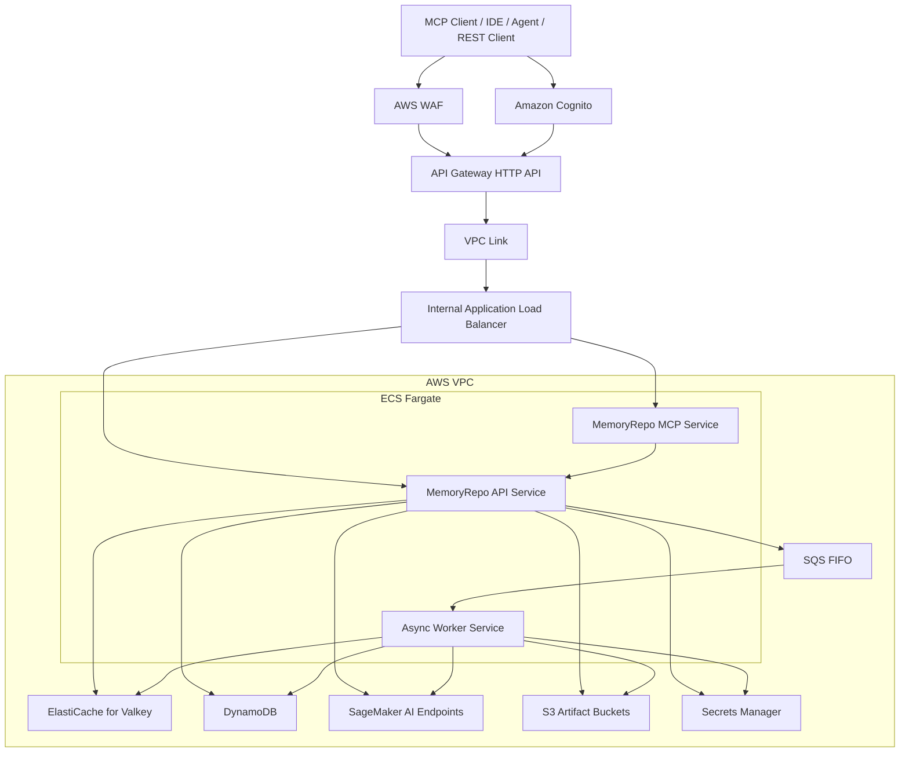
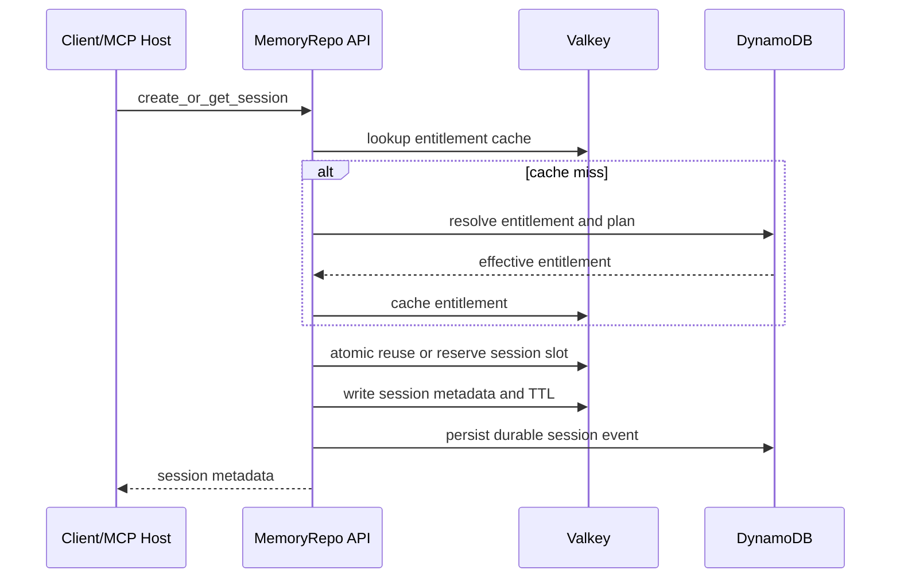
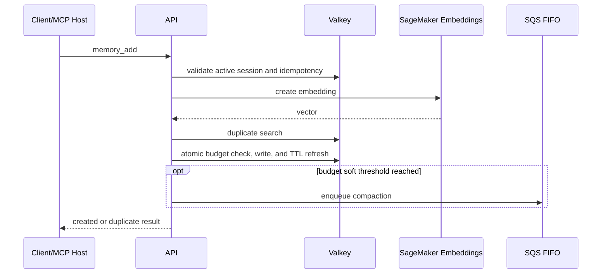
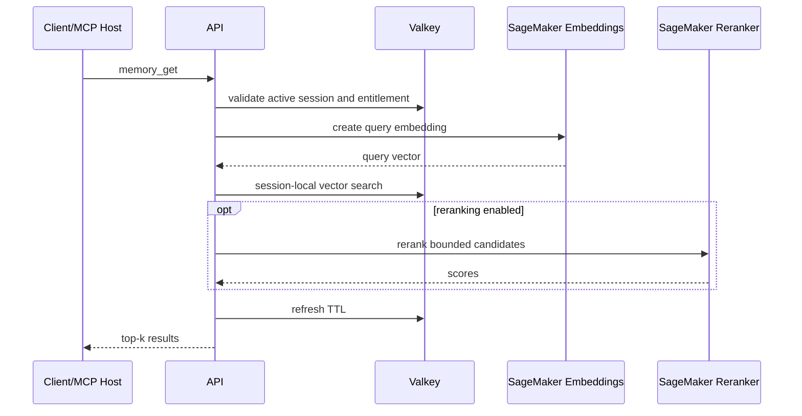
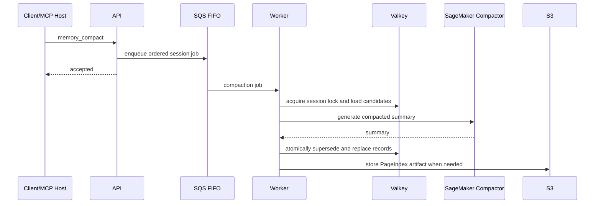

# High-Level Architecture

## 1. Purpose

This document defines the high-level AWS architecture for **MemoryRepo**, a low-latency, session-scoped context-memory service for MCP clients, coding agents, LangChain workflows, and LLM applications.

The architecture separates the synchronous **hot path** from asynchronous compaction, indexing, and cleanup work.

---

## 2. Architectural goals

- Keep session lookup, context add, and retrieval low latency.
- Enforce identity, user ownership, plan entitlements, token budgets, and rate limits.
- Use TTL-backed Valkey state for active sessions.
- Keep expensive compaction and PageIndex workflows asynchronous.
- Scale API, MCP, workers, and inference independently.
- Use AWS services provisioned through Terraform.
- Support secure deployment, auditability, CI/CD, and operational recovery.

---

## 3. AWS component map

| Layer | AWS service | Responsibility |
|---|---|---|
| Edge protection | AWS WAF | Managed rules, abuse controls, request filtering. |
| Entry point | Amazon API Gateway HTTP API | Public HTTPS for REST API and remote MCP. |
| Identity | Amazon Cognito | JWT validation and authenticated identity claims. |
| Private routing | VPC Link + internal ALB | Private routing from API Gateway to ECS services. |
| API runtime | Amazon ECS Fargate | REST API and core memory service. |
| MCP runtime | Amazon ECS Fargate | Streamable HTTP MCP server and tool adapter. |
| Active memory | Amazon ElastiCache for Valkey | Session TTL, memory items, counters, locks, vector retrieval. |
| Durable metadata | Amazon DynamoDB | Users, plans, entitlements, sessions, jobs, idempotency, audit data. |
| Queue | Amazon SQS FIFO | Ordered per-session compaction and indexing jobs. |
| Workers | Amazon ECS Fargate | Compaction, PageIndex, cleanup, repairs. |
| Inference | Amazon SageMaker AI | Embeddings, reranking, and compaction model inference. |
| Artifacts | Amazon S3 | PageIndex trees, source artifacts, evaluation data, model assets. |
| Containers | Amazon ECR | API, worker, and custom model images. |
| Secrets and encryption | Secrets Manager + KMS | Credentials and encryption keys. |
| Operations | CloudWatch + X-Ray | Logs, metrics, alarms, and tracing. |
| CI/CD | CodePipeline + CodeBuild + CodeDeploy | Build, test, deploy, rollback. |
| IaC | Terraform | Environment and resource provisioning. |

---

## 4. Core architecture diagram

---

## 5. Service boundaries

### 5.1 API service

The API service owns:

- REST request validation and versioned endpoint handling.
- Identity, ownership, plan, token-budget, and rate-limit checks.
- Session lifecycle operations.
- `add`, `get`, `remove`, and compaction-job enqueue behavior.
- Valkey reads and writes.
- Synchronous embedding calls and bounded vector retrieval.
- Correlation IDs and operational event emission.

The API must not synchronously perform PageIndex rebuilding, long compaction, large document processing, batch repair, or analytics export.

### 5.2 MCP service

The MCP service owns protocol transport, tool schemas, and response formatting. It must delegate business logic to the API or shared application service, rather than duplicating entitlement or session behavior.

### 5.3 Worker service

The worker service owns:

- Memory compaction.
- PageIndex tree generation and rebuilds.
- Long-form content processing.
- Reindexing and embedding repair.
- Retention cleanup and expiry reconciliation.
- SQS retry and dead-letter handling.

### 5.4 SageMaker endpoints

SageMaker endpoints serve:

- Embedding generation for `add` and `get`.
- Optional reranking of bounded candidates.
- Asynchronous compaction-model calls.
- Optional PageIndex reasoning workloads.

### 5.5 Valkey

Valkey is authoritative for active session validity and contains:

- Session metadata and sliding TTL.
- User active-session counters and indexes.
- Context memory items.
- Token counters and memory counts.
- Session-local vector index.
- Idempotency cache and compaction locks.

### 5.6 DynamoDB

DynamoDB provides durable records for users, plans, entitlements, session history, idempotency, jobs, and audit events. It is not the source of truth for real-time session expiry.

---

## 6. Request paths

### 6.1 Create or get session

### 6.2 Add context

### 6.3 Retrieve context

### 6.4 Compaction

---

## 7. Hot path and async path

### Hot path

| Included | Reason |
|---|---|
| JWT and ownership validation | Security and tenant isolation. |
| Entitlement cache lookup | Plan enforcement with low latency. |
| Valkey session read/write | Active state and TTL authority. |
| Token-budget checks | Correctness. |
| Small embedding inference | Semantic retrieval. |
| Bounded vector retrieval | Low-latency context selection. |
| Optional bounded reranking | Higher relevance for entitled plans. |
| TTL refresh | Session lifecycle correctness. |

### Async path

| Included | Reason |
|---|---|
| Compaction | May require model inference and clustering. |
| PageIndex build or rebuild | Expensive structured indexing. |
| Long document processing | Avoids blocking MCP or API calls. |
| Batch reindexing | Operational maintenance. |
| Expiry reconciliation | Durable state update only. |
| Retention cleanup | Policy-driven background work. |
| Retrieval evaluation | Offline model quality measurement. |

---

## 8. Network model

The target production VPC contains public, private application, and private data subnets.

- API Gateway is internet-facing.
- ECS tasks run without public IPs.
- API Gateway reaches ECS through VPC Link and an internal ALB.
- Valkey is private and accepts traffic only from application and worker security groups.
- DynamoDB and S3 should use VPC endpoints when feasible.
- SageMaker endpoints should use private networking when supported by the selected endpoint mode.
- Developer access must occur through controlled AWS identity and operational tooling, not direct database exposure.

---

## 9. Scaling model

| Component | Scale signal |
|---|---|
| API service | Request volume, CPU, memory, p95 latency. |
| MCP service | Concurrent connections, tool request rate, CPU, p95 tool latency. |
| Worker service | SQS depth, oldest message age, job duration. |
| Valkey | Memory use, eviction rate, CPU, command latency, connections. |
| Embedding endpoint | Invocation rate and p95 model latency. |
| Reranker endpoint | Candidate volume and inference latency. |
| Compaction endpoint | Queue depth, GPU utilization, job wait time. |

API, MCP, worker, and inference workloads must be independently scalable.

---

## 10. Failure behavior

| Dependency failure | Required behavior |
|---|---|
| Valkey unavailable | Fail closed for active session operations. Do not infer active state from stale durable metadata. |
| DynamoDB unavailable | Existing sessions may continue only under a valid cache policy. New session creation should fail when durable validation is needed. |
| Embedding endpoint unavailable | Return retryable inference error or use an explicitly designed fallback. Do not create broken vector records. |
| Reranker unavailable | Degrade to vector-only retrieval. |
| Compactor unavailable | Leave original memory active and retry asynchronously. |
| S3 unavailable | Continue short-memory vector retrieval. Defer PageIndex updates. |
| SQS unavailable | Do not block successful normal add unless compaction is mandatory for budget safety. Emit an operational error. |

---

## 11. Security architecture

MemoryRepo must implement:

- Cognito-validated identity tokens.
- AWS WAF and API Gateway request protections.
- IAM least-privilege roles per ECS task and worker.
- Separate roles for API, MCP, and worker workloads.
- KMS encryption for DynamoDB, S3, SQS, and secrets.
- Secrets Manager for credentials and application secrets.
- Private ElastiCache networking.
- Application-level tenant ownership checks.
- Sanitized logs that exclude raw context by default.
- Audit events for entitlement and lifecycle changes.

---

## 12. Observability architecture

| Signal | AWS service |
|---|---|
| Application logs | CloudWatch Logs |
| Metrics and alarms | CloudWatch Metrics and Alarms |
| API access logs | API Gateway access logs |
| Container resource usage | CloudWatch Container Insights |
| Trace correlation | AWS X-Ray or OpenTelemetry-compatible tracing |
| Queue health | SQS metrics |
| Inference health | SageMaker endpoint metrics |
| Valkey health | ElastiCache metrics |
| Security events | CloudTrail, WAF logs, audit table |

Required dashboards include p95 latency, errors by operation, active sessions by plan, token utilization, retrieval quality signals, queue age, model latency, Valkey pressure, and rate-limit denials.

---

## 13. Environment strategy

| Environment | Purpose |
|---|---|
| `dev` | Developer work and local integration. |
| `stage` | Shared testing, load testing, and release validation. |
| `prod` | Production workload. |

Every environment must have isolated AWS resources, secrets, Terraform state paths, logs, data stores, and inference endpoints. Development resources must never access production user memory.

---

## 14. Architecture decisions pending

Before production implementation, record decisions for:

1. Separate MCP ECS service versus MCP routes inside the API service.
2. Synchronous embedding behavior for every `add` request.
3. Fallback behavior during embedding endpoint outages.
4. Valkey vector-index configuration and capacity plan.
5. PageIndex execution in ECS workers versus custom SageMaker endpoint.
6. Artifact retention after session expiry.
7. Exact remote MCP transport compatibility requirements.
8. Strict entitlement-downgrade enforcement policy.

---

## 15. Acceptance criteria

1. The architecture separates hot and asynchronous responsibilities.
2. Valkey is the authority for active session lifecycle and TTL expiry.
3. DynamoDB durably stores plans, entitlements, sessions, jobs, audit, and idempotency records.
4. API, MCP, workers, and inference scale independently.
5. MCP delegates core business behavior rather than duplicating it.
6. Compaction and PageIndex rebuilds do not block ordinary `add` or `get` requests.
7. Retrieval can degrade to vector-only behavior when optional components fail.
8. Valkey and internal ECS services are not publicly reachable.
9. Terraform can provision isolated dev, stage, and production deployments.
10. Operations can identify bottlenecks across API, Valkey, queues, and SageMaker endpoints.
