# Mermaid Architecture Diagrams

## 1. Purpose

This document contains the primary Mermaid diagrams for MemoryRepo.

These diagrams are intended to be reused in the README, architecture reviews, implementation planning, and future deployment documentation.

---

## 2. System context

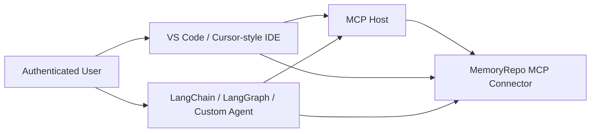

---

## 3. Core AWS architecture

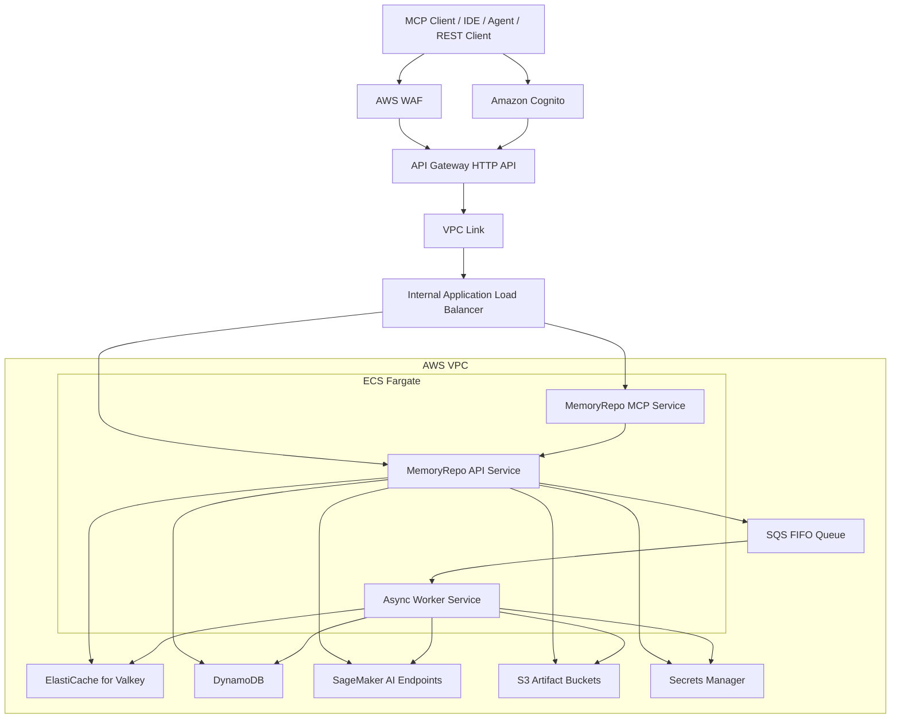

---

## 4. Service responsibility boundaries

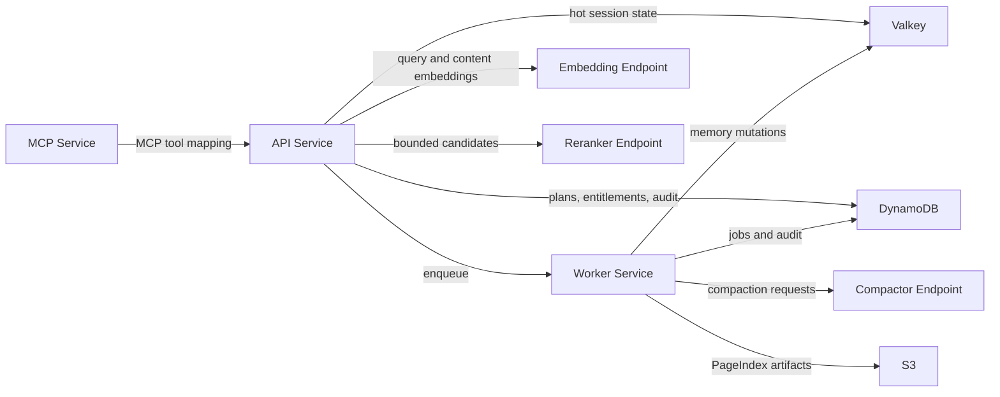

---

## 5. Session lifecycle

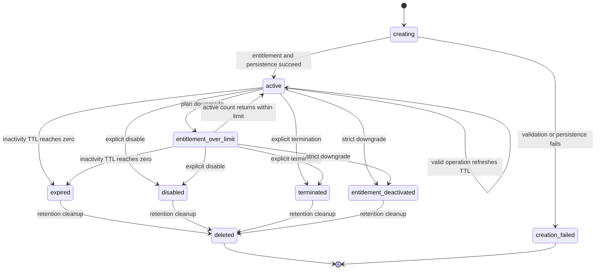

---

## 6. Entitlement resolution and session creation

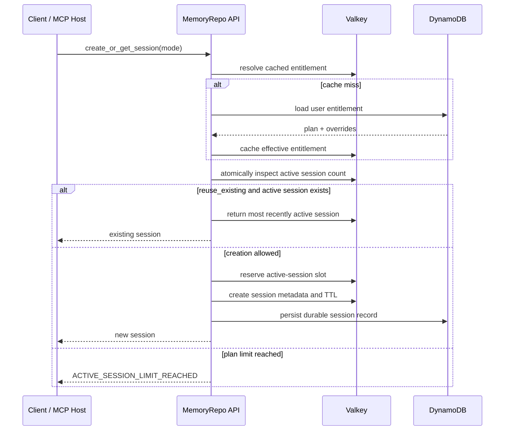

---

## 7. Add-context sequence

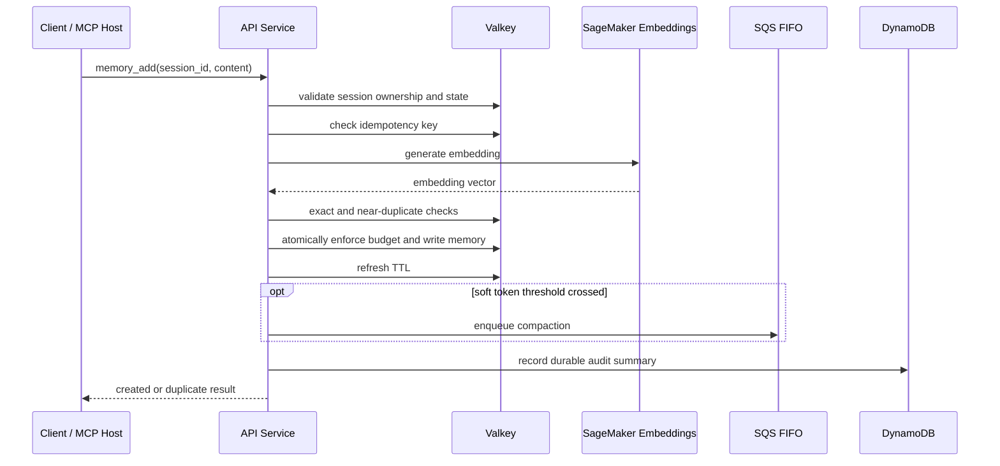

---

## 8. Retrieve-context sequence

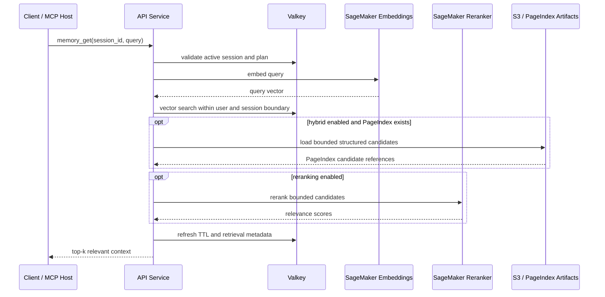

---

## 9. Compaction workflow

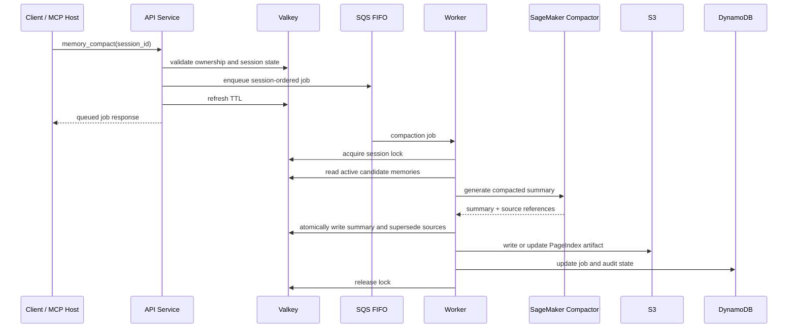

---

## 10. Hybrid retrieval decision flow

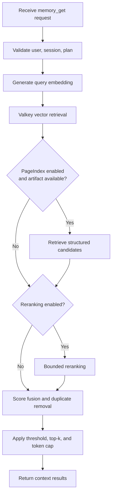

---

## 11. Data ownership boundaries

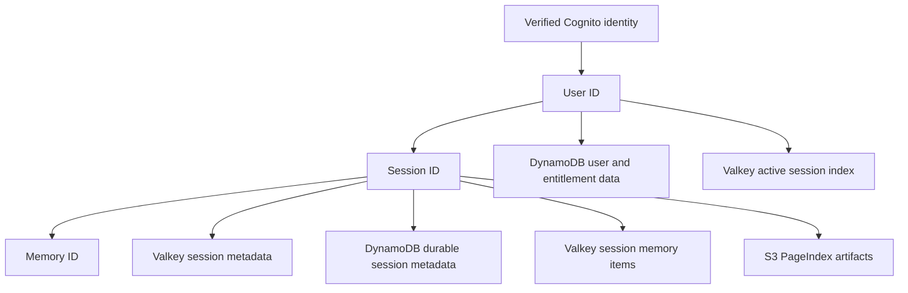

---

## 12. CI/CD delivery flow

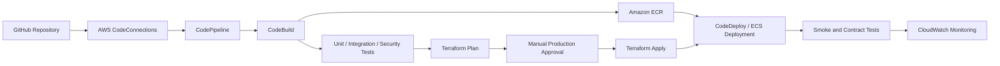

---

## 13. Failure-degradation flow

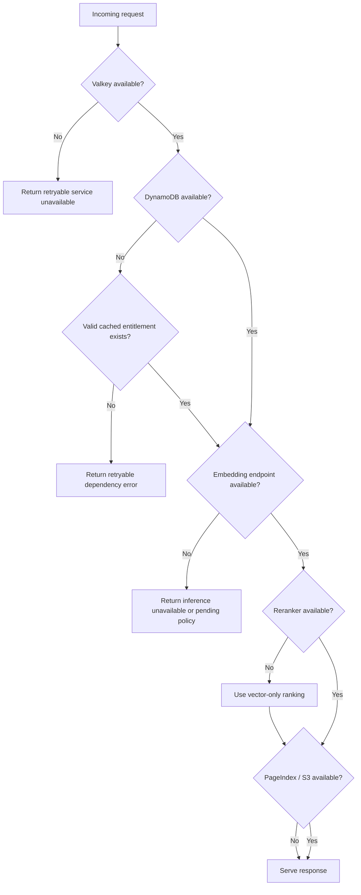

---

## 14. Scaling domains

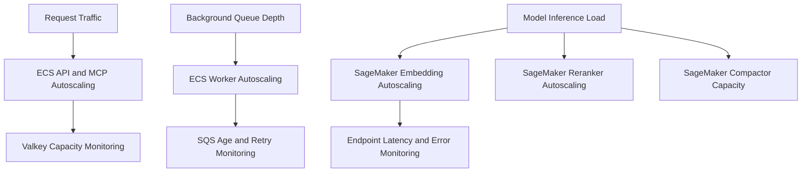

---

## 15. Diagram usage guidance

| Diagram | Primary use |
|---|---|
| System context | Product and integration discussion. |
| Core AWS architecture | Infrastructure design and Terraform planning. |
| Service boundaries | Codebase module ownership. |
| Session lifecycle | Lifecycle implementation and test cases. |
| Entitlement sequence | Atomic session creation and plan enforcement. |
| Add and retrieve sequences | API implementation and latency design. |
| Compaction workflow | Worker, SQS, and model integration. |
| Hybrid retrieval flow | Retrieval evaluation and feature-gate behavior. |
| Ownership boundaries | Security and data-model review. |
| CI/CD flow | Deployment pipeline implementation. |
| Failure flow | Resiliency and incident-response planning. |
| Scaling domains | Autoscaling and capacity planning. |
