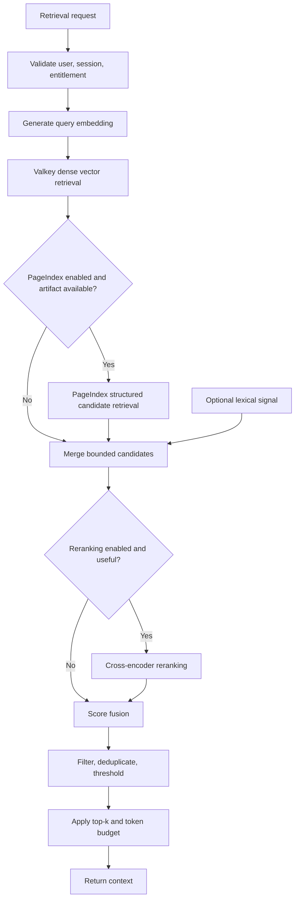

# RAG and Retrieval Design

## 1. Purpose

This document defines the retrieval design for MemoryRepo.

MemoryRepo is not a general enterprise knowledge base. It is a session-scoped context-memory system for LLM agents, MCP clients, IDE assistants, LangChain workflows, and coding tools.

The retrieval system must return a small, relevant set of context items from one active user-owned session. It must balance:

- Relevance.
- Latency.
- Token efficiency.
- User isolation.
- Explainability.
- Robustness under optional dependency failure.

The initial design uses hybrid retrieval:

1. Dense semantic retrieval from Valkey.
2. Structured or vectorless retrieval using PageIndex for long-form or hierarchical context.
3. Optional reranking.
4. Score fusion.
5. Deduplication and response-token shaping.

---

## 2. Retrieval objectives

MemoryRepo retrieval must:

- Search only within a specific user-owned active session.
- Return a bounded number of context items.
- Support semantic similarity search.
- Support content-type and metadata filtering.
- Exclude deleted, superseded, duplicate, expired, or disabled items.
- Support plan-gated structured retrieval and reranking.
- Keep vector-only retrieval fast enough for frequent MCP calls.
- Avoid flooding model prompts with redundant context.
- Preserve useful task state, instructions, decisions, and preferences.
- Provide measurable retrieval quality metrics.

---

## 3. Retrieval modes

| Mode | Description | Primary use |
|---|---|---|
| `vector_only` | Dense embedding search in Valkey with metadata filters. | Default low-latency agent retrieval. |
| `hybrid` | Dense retrieval plus PageIndex structured candidates and optional lexical signals. | Long-form, document-heavy, or complex sessions. |
| `reranked` | Vector or hybrid candidates passed through a cross-encoder reranker. | Higher-value or ambiguous queries. |
| `auto` | Service selects mode based on entitlement, session artifacts, query characteristics, and latency policy. | Default production mode. |

The default MCP behavior should be:

```text
retrieval_mode = auto
```

The service should select `vector_only` unless structured retrieval provides likely value and is permitted.

---

## 4. Retrieval architecture



---

## 5. Dense semantic retrieval

## 5.1 Purpose

Dense retrieval is the default retrieval mechanism.

It converts the user query into an embedding vector and searches active memory items in Valkey using a session-local vector index.

Dense retrieval is suitable for:

- Short user preferences.
- Task state.
- Agent instructions.
- Prior decisions.
- Tool output summaries.
- Code context summaries.
- Compact memory notes.
- Conversational context.

## 5.2 Mandatory filter boundary

Every vector query must filter by:

```text
owner_user_id = authenticated user
session_id = requested session
state = active
```

This filter is mandatory. Similarity alone must never determine access.

## 5.3 Indexed fields

Each active memory item should include:

| Field | Role |
|---|---|
| `embedding` | Semantic vector search. |
| `content` | Returned context text and optional lexical search. |
| `content_type` | Filter by memory type. |
| `importance` | Ranking signal. |
| `created_at_epoch` | Recency signal. |
| `state` | Exclude superseded or deleted items. |
| `owner_user_id` | Tenant boundary. |
| `session_id` | Session boundary. |
| `memory_id` | Stable result identifier. |

## 5.4 Similarity metric

The first implementation should use cosine similarity or the embedding model’s recommended normalized-vector distance.

The similarity metric must be consistent between:

- Add-time embedding generation.
- Query-time embedding generation.
- Duplicate detection.
- Vector index configuration.
- Evaluation metrics.

---

## 6. PageIndex structured retrieval

## 6.1 Role

PageIndex is not a replacement for session-local vector retrieval.

It is used for long-form, structured, or hierarchical context such as:

- Large conversation summaries.
- Uploaded documents.
- Codebase-level summaries.
- Long tool outputs.
- Multi-step task histories.
- Compacted memory trees.
- Research or technical documents attached to a session.

## 6.2 Why PageIndex is selective

Short memory notes do not need a hierarchy. Creating and traversing a structured tree for every small item increases cost and latency without enough retrieval benefit.

PageIndex should operate on aggregated content such as:

```text
Session document bundle
Long transcript summary
Codebase module summary
Structured task history
Large compacted memory tree
```

## 6.3 Artifact lifecycle

A PageIndex artifact must include:

| Field | Purpose |
|---|---|
| `session_id` | Ownership and lookup scope. |
| `tree_version` | Structured index version. |
| `memory_version` | Memory state version used to build the tree. |
| `source_memory_ids` | Memory records represented in the artifact. |
| `created_at` | Build timestamp. |
| `model_version` | Model or algorithm version. |
| `artifact_uri` | S3 location. |
| `state` | Active, stale, rebuild_pending, or failed. |

## 6.4 Retrieval use

During hybrid retrieval:

1. Dense retrieval produces a bounded semantic candidate set.
2. The service checks whether a valid PageIndex artifact exists.
3. PageIndex returns a bounded structured candidate set or branch references.
4. Candidates are merged.
5. Optional reranking and fusion determine final output.

PageIndex must not rebuild a tree during a normal `memory_get` call.

---

## 7. Optional lexical retrieval

The system may add lightweight lexical search as a third signal.

Lexical search can help with:

- Exact identifiers.
- File paths.
- Function names.
- Error codes.
- Command flags.
- Environment variable names.
- Package names.
- Class names.
- Acronyms.

Example:

```text
Query: "Where is MEMORYREPO_TOKEN_BUDGET set?"
```

Dense embeddings may be weaker than exact matching for this kind of query.

Lexical retrieval should remain bounded and session-filtered.

Initial implementation options:

- Valkey full-text search over `content`.
- Keyword extraction plus filtered exact-match ranking.
- Metadata-field matching.

Lexical retrieval is optional for MVP but recommended for coding-agent use cases.

---

## 8. Candidate generation

## 8.1 Candidate pools

Each retrieval mode produces bounded candidates.

| Source | Suggested candidate count |
|---|---:|
| Dense vector search | 10 to 30 |
| PageIndex structured retrieval | 5 to 15 |
| Lexical retrieval | 5 to 15 |
| Total merged pool before reranking | 10 to 40 |
| Reranker input | 5 to 15 |
| Final result count | Plan-allowed top-k |

The exact counts must be configurable by environment and plan.

## 8.2 Candidate normalization

Before score fusion, the service must normalize source-specific scores.

Examples:

- Cosine similarity.
- PageIndex rank or confidence.
- Lexical relevance score.
- Cross-encoder score.
- Recency score.
- Importance score.

Do not combine raw scores from unrelated systems without normalization.

---

## 9. Score fusion

## 9.1 Base scoring model

For hybrid retrieval, the service may use:

```text
final_score =
    w_dense * normalized_dense_score
  + w_structured * normalized_structured_score
  + w_lexical * normalized_lexical_score
  + w_reranker * normalized_reranker_score
  + w_recency * recency_score
  + w_importance * importance_score
```

The weights must be configurable.

## 9.2 Initial weight directions

### Vector-only mode

```text
dense_score      = 0.80
recency_score    = 0.10
importance_score = 0.10
```

### Hybrid mode without reranking

```text
dense_score       = 0.55
structured_score  = 0.20
lexical_score     = 0.10
recency_score     = 0.05
importance_score  = 0.10
```

### Hybrid mode with reranking

```text
dense_score       = 0.35
structured_score  = 0.15
lexical_score     = 0.05
reranker_score    = 0.30
recency_score     = 0.05
importance_score  = 0.10
```

These values are starting configurations, not permanent product assumptions.

## 9.3 Recency score

Recency should influence ranking without overwhelming semantic relevance.

Suggested conceptual function:

```text
recency_score = exp(-age_hours / decay_half_life_hours)
```

The decay half-life should be configurable by content type.

Examples:

| Content type | Suggested recency behavior |
|---|---|
| `task_state` | Fast decay. |
| `tool_output` | Fast to medium decay. |
| `instruction` | Slow decay. |
| `preference` | Slow decay. |
| `code_context` | Medium decay. |
| `compacted_summary` | Medium decay. |

## 9.4 Importance score

Importance is a client-provided or system-derived signal.

It must be bounded:

```text
0.0 <= importance <= 1.0
```

Importance should never override tenant filtering, state filtering, or hard similarity thresholds.

---

## 10. Threshold policy

## 10.1 Retrieval minimum threshold

The client may provide `min_similarity`, but the service must enforce server-side allowed bounds.

Initial conceptual defaults:

| Retrieval type | Default threshold |
|---|---:|
| Dense-only | 0.78 |
| Hybrid | 0.70 after normalized fusion |
| Exact lexical identifier match | May bypass dense threshold if explicit match policy permits |
| Duplicate detection | 0.92 |
| Merge candidate detection | 0.82 to 0.92 |

Thresholds must be calibrated using actual evaluation data.

## 10.2 Empty-result behavior

If no candidate passes required filters and thresholds:

```text
Return an empty result set.
```

Do not return weak, unrelated context simply because the client requested `top_k = 3`.

---

## 11. Deduplication before return

Retrieved results may overlap because:

- A compacted summary and source item are both candidates.
- Dense and lexical retrieval return the same memory item.
- Multiple memories contain nearly identical instructions.
- PageIndex returns a parent summary and dense retrieval returns a child note.

The service must deduplicate before returning results.

### Deduplication rules

1. Prefer active compacted summaries over superseded source items.
2. Prefer more specific child context if it is materially more relevant than a broad parent summary.
3. Avoid returning a summary and all of its source memories unless the caller explicitly requests provenance.
4. Collapse exact duplicate memory IDs.
5. Collapse semantic near-duplicates using configured threshold.
6. Preserve contradictory memories when they are both relevant.

---

## 12. Contradiction handling

Retrieval must not erase conflicts.

Example:

```text
Memory A: Use DynamoDB for user entitlements.
Memory B: Use PostgreSQL for user entitlements.
```

If both are active and relevant:

- Return both when appropriate.
- Include timestamps or source metadata in authorized debug mode.
- Allow the client or downstream model to resolve the conflict.
- Do not fabricate a merged answer in retrieval layer.

Compaction should mark unresolved contradictions clearly instead of hiding them.

---

## 13. Reranking design

## 13.1 Role

A reranker improves ordering when embedding similarity alone is insufficient.

Use reranking for:

- Ambiguous queries.
- Higher-tier plans.
- Complex technical context.
- Hybrid candidate sets.
- Long or semantically similar candidate notes.

## 13.2 Input limit

Reranking must operate on a small bounded candidate set.

Initial recommendation:

```text
5 to 15 candidates
```

Do not rerank the full session memory set.

## 13.3 Reranker output

The reranker must return a relevance score per candidate.

The retrieval service must store or expose:

- `reranker_applied`.
- `reranker_model_version`.
- Candidate count.
- Timeout or fallback status.

Debug details must remain feature-gated.

---

## 14. Retrieval response shaping

## 14.1 Top-k rules

The service must enforce:

```text
effective_top_k = min(
    requested_top_k,
    plan_max_retrieval_top_k,
    server_global_max_top_k
)
```

## 14.2 Return-token budget

The client may specify `max_return_tokens`.

The service must:

1. Rank candidates.
2. Add results in ranking order.
3. Stop before exceeding return-token budget.
4. Return fewer than top-k results when required.

## 14.3 Content trimming

The service may return:

- Full memory content for small items.
- A compacted excerpt for large items.
- A summary plus source reference for PageIndex-derived items.

Content trimming must preserve meaning and identify when truncation occurred.

---

## 15. Retrieval diagnostics

Diagnostics help evaluate retrieval but must be restricted.

Authorized debug output may include:

| Field | Purpose |
|---|---|
| `dense_score` | Semantic similarity signal. |
| `structured_score` | PageIndex-derived signal. |
| `lexical_score` | Exact-term signal. |
| `reranker_score` | Cross-encoder relevance. |
| `recency_score` | Time-decay contribution. |
| `importance_score` | Priority contribution. |
| `final_score` | Final fused score. |
| `source` | Dense, lexical, structured, hybrid. |
| `model_versions` | Embedding and reranker versions. |
| `tree_version` | PageIndex version. |
| `filtered_reason` | Why a candidate was excluded. |

Default MCP responses should not include full diagnostics.

---

## 16. Retrieval fallback behavior

| Failure | Required behavior |
|---|---|
| Valkey unavailable | Fail closed with retryable service error. |
| Embedding endpoint unavailable | Return retryable retrieval inference error unless lexical fallback is explicitly enabled. |
| PageIndex unavailable | Continue with vector-only retrieval. |
| S3 PageIndex artifact unavailable | Continue with vector-only retrieval. |
| Reranker unavailable | Return non-reranked vector or hybrid results. |
| Lexical index unavailable | Continue with dense retrieval. |
| One candidate source times out | Use completed bounded sources when policy permits. |

Fallback must never bypass user, session, or state filters.

---

## 17. Evaluation dataset

The project must build a retrieval evaluation dataset before tuning production thresholds.

Each evaluation record should include:

| Field | Purpose |
|---|---|
| `session_fixture_id` | Test session identifier. |
| `memory_items` | Controlled memory corpus. |
| `query` | Retrieval query. |
| `relevant_memory_ids` | Gold relevant items. |
| `acceptable_memory_ids` | Secondary acceptable items. |
| `expected_top_k` | Expected number of results. |
| `metadata_filters` | Required constraints. |
| `scenario_type` | Coding, task-state, preference, document, conflict, duplicate. |

Include scenarios for:

- User preference retrieval.
- Current task state.
- Exact code identifier lookup.
- Similar but distinct memories.
- Duplicate instructions.
- Contradictory guidance.
- PageIndex long-document retrieval.
- Expired or superseded items.
- Token-budget constrained responses.
- Cross-session isolation.

---

## 18. Evaluation metrics

The retrieval system must track:

| Metric | Meaning |
|---|---|
| Recall@k | Fraction of relevant items retrieved in top-k. |
| Precision@k | Fraction of returned items that are relevant. |
| MRR | Rank quality of first relevant result. |
| nDCG@k | Ranking quality with graded relevance. |
| Empty retrieval rate | Frequency of no-result responses. |
| False-context rate | Frequency of irrelevant context returned. |
| Duplicate-return rate | Frequency of redundant results in one response. |
| Contradiction visibility rate | Whether relevant conflicting context remains visible. |
| Token efficiency | Relevant information returned per response token. |
| Retrieval latency | p50, p95, p99 by mode. |
| Reranker lift | Quality improvement over vector-only baseline. |
| PageIndex lift | Quality improvement for long-form sessions. |

Quality metrics must be evaluated separately for:

- Vector-only.
- Hybrid.
- Hybrid plus reranker.
- Different entitlement tiers if feature flags alter behavior.

---

## 19. Rollout strategy

The recommended rollout sequence is:

1. Vector-only retrieval.
2. Add metadata filters and response-token limits.
3. Add duplicate suppression.
4. Add lexical signal for code and identifiers.
5. Add reranking behind a feature flag.
6. Add PageIndex for selected long-form session workloads.
7. Tune hybrid fusion using evaluation data.
8. Enable premium-tier retrieval features after latency and quality validation.

Do not deploy hybrid retrieval by default before vector-only retrieval has a reliable baseline.

---

## 20. Acceptance criteria

This document is satisfied when:

1. Every retrieval query is constrained by authenticated user and session ID.
2. Vector-only retrieval works without PageIndex or reranking.
3. Hybrid retrieval adds structured candidates only when enabled and available.
4. PageIndex artifacts are built asynchronously and never rebuilt during normal retrieval.
5. Candidate counts remain bounded at every stage.
6. Score fusion uses normalized signals.
7. Retrieval filters inactive, deleted, duplicate, and superseded items.
8. Returned context is deduplicated and token-budgeted.
9. Contradictory relevant memories can remain visible.
10. Reranking failure degrades gracefully.
11. Retrieval quality is measured with an evaluation dataset and ranking metrics.
12. Production thresholds and weights are configurable rather than hardcoded.
