# CI/CD Design

## 1. Purpose

This document defines the CI/CD workflow for MemoryRepo.

MemoryRepo uses GitHub as the source-control system and GitHub Actions as the primary continuous-integration and deployment orchestrator.

AWS remains the runtime and infrastructure platform. GitHub Actions builds, tests, validates Terraform, publishes container images to Amazon ECR, and deploys approved changes to AWS environments.

---

## 2. Delivery goals

The CI/CD system must:

- Validate every change before it reaches `dev`.
- Automatically build and deploy changes pushed to `dev`.
- Automatically build and deploy approved release changes pushed to `main`.
- Keep `dev` and `main` as long-lived branches with shared history.
- Require feature branches to squash-merge into `dev`.
- Prevent direct unreviewed changes to protected branches.
- Run fast checks before expensive integration and deployment steps.
- Use environment-specific Terraform plans and applies.
- Build reproducible container images.
- Publish images to Amazon ECR.
- Deploy API, MCP, worker, and model-serving components independently.
- Support rollback.
- Protect secrets and cloud credentials.
- Produce auditable deployment records.

---

## 3. Branching model

## 3.1 Long-lived branches

| Branch | Purpose | Deployment target |
|---|---|---|
| `dev` | Shared integration branch. | Development environment. |
| `main` | Release branch. | Production environment. |

`dev` and `main` must share history.

The intended flow is:

```text
feature branch
    -> squash merge into dev
    -> merge dev into main
```

Do not use unrelated histories or periodic copy-paste branch recreation.

## 3.2 Feature branches

Feature branches should use a consistent pattern:

```text
feature/<short-description>
fix/<short-description>
chore/<short-description>
docs/<short-description>
experiment/<short-description>
```

Examples:

```text
feature/session-lifecycle
feature/valkey-memory-store
fix/token-budget-race
docs/mcp-contract
experiment/turboquant-benchmark
```

## 3.3 Merge policy

### Feature branch into `dev`

Feature branches must:

1. Open a pull request targeting `dev`.
2. Pass required checks.
3. Receive required review approval.
4. Use **squash merge** into `dev`.
5. Delete the feature branch after merge unless it remains needed.

Squash merge keeps the `dev` history clean and makes each completed unit of work easy to revert.

### `dev` into `main`

`dev` must merge into `main` through a release pull request.

Recommended merge behavior:

```text
Create a standard merge commit from dev into main.
```

Reason:

- `dev` and `main` retain a shared, understandable history.
- Release boundaries remain visible.
- The production release can be traced to a specific merge commit.
- Reverting a release is clearer than undoing many independent squashed commits.

Do not squash merge `dev` into `main` by default because it obscures the release relationship between the two long-lived branches.

---

## 4. Branch protection rules

## 4.1 `dev` branch protection

Require:

- Pull request before merge.
- At least one approving review.
- Required status checks.
- Branch up to date before merge.
- Squash merge only for pull requests into `dev`.
- No direct pushes except approved automation or repository administrators under emergency policy.
- Dismiss stale reviews after new commits.
- Require conversation resolution.
- Require signed commits if repository policy supports it.

Required checks:

```text
lint
unit-tests
type-check
security-scan
terraform-fmt
terraform-validate
container-build
```

## 4.2 `main` branch protection

Require:

- Pull request from `dev` unless emergency release policy applies.
- At least one or two required approvals, depending on team size.
- Required status checks.
- Successful development deployment verification.
- Production Terraform plan review.
- Manual environment approval before production apply.
- Standard merge commit from `dev`.
- No direct pushes.

Required checks:

```text
all dev checks
integration-tests
contract-tests
terraform-plan-prod
image-scan
release-notes-check
deployment-smoke-tests
```

---

## 5. GitHub Actions workflow inventory

| Workflow file | Trigger | Purpose |
|---|---|---|
| `.github/workflows/pr-checks.yml` | Pull request to `dev` or `main` | Fast validation and security checks. |
| `.github/workflows/dev-deploy.yml` | Push to `dev` | Build, test, publish, Terraform apply, deploy to development. |
| `.github/workflows/prod-deploy.yml` | Push to `main` | Build, validate, require approval, deploy to production. |
| `.github/workflows/terraform-plan.yml` | Pull request with infra changes | Terraform format, validate, plan, and PR comment. |
| `.github/workflows/model-evaluation.yml` | Model or retrieval changes | Offline evaluation and quality gate. |
| `.github/workflows/security-scan.yml` | Pull request, push, schedule | Dependency, container, IaC, and secret scanning. |
| `.github/workflows/manual-rollback.yml` | Manual dispatch | Roll back ECS or model deployment. |
| `.github/workflows/nightly-validation.yml` | Scheduled | Integration, load, and drift checks. |

---

## 6. Pull request checks

Every pull request must run the following checks.

## 6.1 Source validation

```text
Python formatting
Python linting
Python type checking
Unit tests
Dependency lockfile validation
API schema validation
MCP tool schema validation
OpenAPI validation
Markdown link and documentation checks
```

## 6.2 Infrastructure validation

```text
terraform fmt -check
terraform init
terraform validate
terraform plan
Terraform static analysis
Terraform security scan
```

## 6.3 Security validation

```text
Secret scanning
Dependency vulnerability scan
Container image scan
Infrastructure-as-code scan
License scan where applicable
```

## 6.4 Build validation

```text
Build API container
Build MCP container
Build worker container
Run container smoke tests
Verify image metadata
```

## 6.5 Quality validation

For retrieval or model-impacting changes:

```text
Run retrieval evaluation fixtures
Measure Recall@k
Measure MRR
Measure nDCG
Check latency benchmark regression
Check compaction factual-retention regression
```

A model or retrieval change must not merge if it causes a configured regression beyond accepted threshold.

---

## 7. Development deployment workflow

## 7.1 Trigger

```yaml
on:
  push:
    branches:
      - dev
```

Every push to `dev` must automatically trigger the development deployment workflow.

## 7.2 Workflow stages

```mermaid
flowchart LR
    Push[Push to dev]
    Checkout[Checkout source]
    Validate[Lint, test, type-check]
    Scan[Security scans]
    Build[Build containers]
    ECR[Push images to ECR]
    TFPlan[Terraform plan for dev]
    TFApply[Terraform apply for dev]
    Deploy[Deploy ECS services]
    Smoke[Run smoke and contract tests]
    Report[Publish deployment result]

    Push --> Checkout
    Checkout --> Validate
    Validate --> Scan
    Scan --> Build
    Build --> ECR
    ECR --> TFPlan
    TFPlan --> TFApply
    TFApply --> Deploy
    Deploy --> Smoke
    Smoke --> Report
```



## 7.3 Development deployment rules

- Use the `dev` Terraform workspace or dedicated state path.
- Tag images with immutable Git SHA tags.
- Optionally add a mutable `dev-latest` tag for convenience, but deployment must reference immutable SHA tags.
- Deploy API, MCP, and worker services independently where only one changed.
- Run smoke tests after deploy.
- Fail the workflow if health checks, contract tests, or basic MCP tool tests fail.
- Post deployment outcome to pull request or commit status where configured.

---

## 8. Production deployment workflow

## 8.1 Trigger

```yaml
on:
  push:
    branches:
      - main
```

Every push to `main` must automatically begin the production release workflow.

The workflow must stop at protected environment approval before any production-changing Terraform apply or service deployment.

## 8.2 Workflow stages


## 8.3 Production release requirements

Before production approval, the workflow must provide:

- Commit SHA.
- Change summary.
- Container image digests.
- Terraform plan output.
- Model version changes.
- Database or schema migration summary.
- Known risk flags.
- Rollback target.

After deployment:

- Run REST health checks.
- Run MCP tool smoke tests.
- Validate API Gateway routing.
- Validate ECS desired and running counts.
- Validate Valkey connectivity through service health checks.
- Run minimal add/get/remove integration flow against a test user.
- Monitor error rate and p95 latency during a short post-deploy window.

---

## 9. GitHub environments

Configure GitHub Environments:

| Environment | Branch | Approval required? | AWS target |
|---|---|---:|---|
| `development` | `dev` | No | Dev account or dev workspace. |
| `staging` | Optional release candidate branch or manual dispatch | Optional | Stage account or stage workspace. |
| `production` | `main` | Yes | Production account or prod workspace. |

Production environment protection should require designated reviewers.

Environment secrets must be scoped narrowly.

---

## 10. AWS authentication from GitHub Actions

GitHub Actions must authenticate to AWS using OpenID Connect federation.

Do not store long-lived AWS access keys in GitHub Secrets.

Recommended flow:

```text
GitHub Actions OIDC token
    -> AWS IAM role trust policy
    -> short-lived AWS credentials
    -> Terraform, ECR, ECS, SageMaker, and AWS API operations
```

Use separate IAM roles for:

- Development deployment.
- Production deployment.
- Terraform plan-only jobs.
- Container publishing.
- Model evaluation.
- Rollback workflow.

Each role must be restricted by repository, branch, environment, and workflow conditions where AWS IAM trust policy supports it.

---

## 11. Container build and image policy

## 11.1 Images

Build separate images for:

- `memoryrepo-api`
- `memoryrepo-mcp`
- `memoryrepo-worker`
- Optional custom SageMaker inference containers

## 11.2 Image tags

Every image must receive:

```text
git-<full-commit-sha>
```

Optional convenience tags:

```text
dev-latest
prod-latest
```

Immutable SHA or digest references must be used for deployment.

## 11.3 Image metadata

Each image must include:

```text
git_commit
build_timestamp
service_name
environment-independent version
base_image
dependency_lock_hash
```

## 11.4 Image scans

Image publication must run vulnerability scanning.

Deployment must fail or require explicit override when severity exceeds defined policy.

---

## 12. Terraform workflow

## 12.1 State separation

Terraform state must be isolated by environment.

Example:

```text
s3://memoryrepo-tfstate/dev/terraform.tfstate
s3://memoryrepo-tfstate/stage/terraform.tfstate
s3://memoryrepo-tfstate/prod/terraform.tfstate
```

Use S3 state locking with Terraform-supported lockfile configuration.

## 12.2 Plan on pull request

A pull request that changes Terraform files must:

1. Run `terraform fmt -check`.
2. Run `terraform validate`.
3. Produce a plan for affected environment.
4. Publish plan summary to the pull request.
5. Block merge if validation fails.

## 12.3 Apply rules

| Branch | Terraform action |
|---|---|
| Feature branch | Plan only. |
| `dev` | Automatic apply to dev after checks pass. |
| `main` | Apply to prod only after protected approval. |

## 12.4 Infrastructure drift

Nightly or scheduled workflows should run Terraform plan in read-only drift-detection mode.

Drift findings must create an issue or alert for review.

---

## 13. ECS deployment strategy

## 13.1 API and MCP services

Use rolling or blue/green deployment based on service criticality.

Recommended production direction:

```text
Blue/green deployment for API and MCP services.
Rolling deployment for workers where job compatibility is maintained.
```

## 13.2 Deployment safeguards

Before traffic shift:

- New task definition is healthy.
- Application health endpoint passes.
- Required secrets load successfully.
- Valkey connection check passes.
- Required model endpoint reachability check passes.
- Database access check passes.

After traffic shift:

- Run smoke tests.
- Monitor 5xx rate.
- Monitor p95 latency.
- Monitor authentication errors.
- Monitor MCP tool failures.

## 13.3 Worker deployment compatibility

Worker changes must preserve compatibility with queued job messages.

When job payload schema changes:

- Version messages.
- Support old and new schema during transition.
- Drain or migrate queued messages before removing old support.

---

## 14. SageMaker deployment strategy

Model changes must be separated from ordinary API deployments.

Model workflow stages:

```text
Build model container or register artifact
    -> run evaluation
    -> register model version
    -> approve for stage
    -> deploy candidate endpoint
    -> run benchmark
    -> approve for production
    -> canary rollout
    -> monitor
```

Required gates:

- Retrieval quality metrics.
- Compaction factual-retention score.
- Latency benchmark.
- Container scan.
- Model metadata validation.
- Rollback target.

Do not deploy a new embedding model to production solely because its container built successfully.

---

## 15. Database and schema migrations

DynamoDB and Valkey changes must be backward compatible.

### 15.1 DynamoDB migration rules

- Prefer additive attributes.
- Do not require a full table rewrite for a deployment.
- Backfill asynchronously.
- Support old and new records during transition.
- Version entity schemas when needed.

### 15.2 Valkey key migration rules

- Use versioned key prefixes when schema changes are incompatible.
- Support dual read or dual write during migration.
- Ensure TTL behavior remains correct.
- Do not invalidate all active sessions without explicit migration policy.

### 15.3 API contract changes

- Version endpoints or maintain backward compatibility.
- Add fields before requiring them.
- Avoid removing response fields without deprecation period.
- Validate MCP schema compatibility separately.

---

## 16. Rollback strategy

## 16.1 ECS rollback

Rollback must support:

- Redeploy prior task definition.
- Restore prior image digest.
- Revert traffic through deployment controller.
- Run smoke tests after rollback.

## 16.2 Terraform rollback

Terraform rollback must be deliberate.

Do not automatically apply reverse infrastructure changes without reviewing state and data consequences.

For unsafe infrastructure changes:

- Use feature flags.
- Use staged rollout.
- Keep old resources during migration.
- Perform controlled cutover.

## 16.3 Model rollback

Model rollback must support:

- Switch endpoint alias or routing to prior approved model.
- Retain prior model artifacts.
- Maintain compatible embedding index strategy.
- Avoid mixed incompatible embedding spaces in a session.

## 16.4 Emergency workflow

Provide a manually triggered GitHub Actions workflow:

```text
manual-rollback.yml
```

Inputs:

- Environment.
- Service or endpoint.
- Target image digest or task definition.
- Target model version where applicable.
- Reason.
- Incident reference.

The workflow must require production environment approval.

---

## 17. Required repository structure

```text
.github/
  workflows/
    pr-checks.yml
    dev-deploy.yml
    prod-deploy.yml
    terraform-plan.yml
    model-evaluation.yml
    security-scan.yml
    manual-rollback.yml
    nightly-validation.yml

infra/
  environments/
    dev/
    stage/
    prod/
  modules/

services/
  api/
  mcp/
  worker/

models/
  embedding/
  reranker/
  compactor/

tests/
  unit/
  integration/
  contract/
  load/
  security/
  retrieval/
```

---

## 18. Required status checks

The following checks must be required before merge into `dev`:

```text
python-lint
python-type-check
unit-tests
api-contract-tests
mcp-schema-tests
terraform-fmt
terraform-validate
terraform-plan
dependency-scan
secret-scan
container-build
container-scan
```

The following additional checks must be required before merge into `main`:

```text
integration-tests
load-smoke-tests
retrieval-evaluation
model-regression-check
production-terraform-plan
release-approval
```

---

## 19. Acceptance criteria

This document is satisfied when:

1. `dev` and `main` are protected long-lived branches with shared history.
2. Feature branches squash-merge into `dev`.
3. `dev` merges into `main` through a release pull request and normal merge commit.
4. Every push to `dev` automatically builds, tests, and deploys to development.
5. Every push to `main` automatically starts the production release workflow.
6. Production apply and deployment require protected environment approval.
7. GitHub Actions uses AWS OIDC, not long-lived AWS keys.
8. All images are built with immutable commit SHA tags or digests.
9. Terraform plans run on infrastructure pull requests.
10. Dev Terraform applies automatically after passing checks.
11. Production Terraform applies only after approval.
12. API, MCP, worker, and SageMaker deployment paths support independent releases.
13. Rollback workflows exist for ECS and model changes.
14. CI blocks merges for test, security, contract, Terraform, or quality failures.
