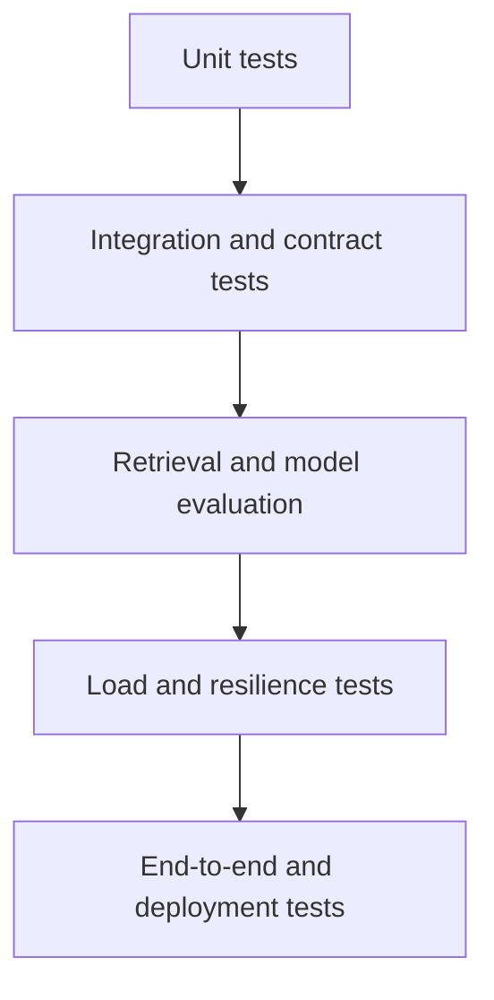

# Test Strategy

## 1. Purpose

This document defines the testing strategy for MemoryRepo.

MemoryRepo combines session state, entitlement enforcement, vector retrieval, MCP tools, async jobs, AWS infrastructure, and model inference. A single test type is not enough.

The test strategy must validate:

- Correctness.
- User isolation.
- Session lifecycle behavior.
- Retrieval quality.
- API and MCP contract stability.
- Background-job safety.
- Infrastructure safety.
- Deployment safety.
- Performance targets.
- Security controls.

---

## 2. Testing principles

MemoryRepo tests must follow these principles:

- Test behavior close to the business rule that requires it.
- Prefer deterministic tests for core state transitions.
- Use mocks for unit tests and real dependencies for integration tests.
- Keep tenant-isolation tests mandatory.
- Treat retrieval quality as measurable, not subjective.
- Test failure and fallback paths, not only happy paths.
- Run fast tests on every pull request.
- Run slower integration, load, and evaluation tests on `dev`, scheduled workflows, or release gates.
- Make test fixtures versioned and reproducible.
- Avoid using real user context in automated tests.

---

## 3. Test pyramid



Recommended emphasis:

| Test layer | Relative volume | Main purpose |
|---|---:|---|
| Unit | Highest | Fast validation of domain logic. |
| Integration | High | Validate service boundaries and persistence. |
| Contract | Medium | Preserve REST and MCP compatibility. |
| Retrieval evaluation | Medium | Track ranking quality. |
| Security | Medium | Validate isolation and abuse controls. |
| Load | Lower frequency | Validate p95 and bottlenecks. |
| End-to-end | Lower volume | Validate deployed system behavior. |

---

## 4. Test environments

| Environment | Purpose | Dependencies |
|---|---|---|
| Local | Fast developer feedback. | Mock embedding, local Valkey, local DynamoDB or fake repositories. |
| CI PR | Required validation before merge. | Containers, mocked AWS, isolated test data. |
| Dev | Deployed integration validation. | Real AWS dev resources. |
| Stage | Production-like load and release validation. | Real AWS stage resources. |
| Prod smoke | Minimal post-deploy validation. | Real production with dedicated test identity. |

---

## 5. Unit tests

## 5.1 Scope

Unit tests must cover business logic without requiring real AWS infrastructure.

Primary targets:

- Entitlement resolution.
- Session state transitions.
- Session-limit calculation.
- Token-budget calculation.
- Request validation.
- Memory content-type validation.
- Duplicate normalization and hashing.
- Retrieval score normalization.
- Score fusion.
- Response token shaping.
- Error mapping.
- Idempotency handling.
- Job state transitions.
- Retry classification.
- Lock ownership behavior.
- Feature flag decisions.
- TTL refresh eligibility.

## 5.2 Required unit-test cases

### Entitlements

- No entitlement assignment defaults to Free.
- User override changes effective limit.
- Suspended entitlement rejects service access.
- Plan version change resolves correctly.
- Feature flag override enables or disables a feature.
- Expired assignment does not remain active.

### Sessions

- Valid state transitions succeed.
- Invalid transitions fail.
- Free plan allows one active session.
- Premium limit comes from entitlement data.
- `reuse_existing` returns latest active session.
- `create_new` rejects when limit reached.
- Expired session is not considered active.
- Terminated session cannot be reused.

### Memory

- Invalid content type is rejected.
- Token count is validated.
- Exact duplicate normalization is consistent.
- Duplicate does not increase token usage.
- Remove decrements usage correctly.
- Superseded memory is excluded from normal retrieval.
- Contradictory memory is not automatically dropped.

### Retrieval

- Top-k is capped by plan limit.
- Token response cap stops result addition.
- Similarity threshold filters weak candidates.
- Score fusion is deterministic.
- Reranker weight is ignored when reranking is absent.
- Stale PageIndex artifact is rejected or bypassed according to policy.

### Jobs

- Retryable and permanent errors classify correctly.
- Job cannot move from terminal state to running.
- Stale job is cancelled.
- Idempotency key construction is stable.
- Lock release requires lock ownership.

---

## 6. Integration tests

## 6.1 Scope

Integration tests validate real interactions between service components.

Initial local integration stack:

- API service.
- Local Valkey.
- DynamoDB Local or isolated test table.
- Local SQS-compatible test setup or mocked queue adapter.
- Mock embedding provider.
- Worker service.
- Test configuration.

## 6.2 Required integration flows

### Session integration

1. Create user and Free entitlement.
2. Resolve session.
3. Resolve again with `reuse_existing`.
4. Verify same session returns.
5. Attempt `create_new`.
6. Verify limit rejection.
7. Advance or simulate TTL.
8. Verify session expiration.
9. Verify durable state updates after reconcile.

### Memory integration

1. Resolve session.
2. Add memory.
3. Add exact duplicate.
4. Verify canonical memory response.
5. Add memory near token limit.
6. Verify soft-threshold behavior.
7. Add memory beyond hard limit.
8. Verify rejection.
9. Remove memory.
10. Verify counters and retrieval index update.

### Retrieval integration

1. Add several memory items.
2. Query relevant item.
3. Verify session filter.
4. Verify user filter.
5. Verify content-type filter.
6. Verify top-k and token cap.
7. Verify empty result behavior.
8. Verify superseded memory exclusion.

### Job integration

1. Queue compaction.
2. Verify durable job record.
3. Worker consumes message.
4. Verify lock acquisition.
5. Verify summary commit.
6. Verify source provenance.
7. Verify duplicate queue message is safe.
8. Verify retryable failure behavior.
9. Verify DLQ behavior with forced permanent error.

---

## 7. API contract tests

## 7.1 Goal

API contract tests ensure the REST API matches `18_api_contract.md`.

Contract tests must validate:

- Request schema.
- Required headers.
- Response body shape.
- Error envelope shape.
- HTTP status codes.
- Idempotency behavior.
- Correlation ID response header.
- Authentication behavior.
- Feature-gate behavior.

## 7.2 Required endpoint coverage

| Endpoint | Required contract coverage |
|---|---|
| `POST /v1/sessions:resolve` | Reuse, create, limit rejection, invalid request. |
| `GET /v1/sessions/{id}` | Owner success, non-owner denial, expiry. |
| `POST /v1/sessions/{id}:terminate` | Success, already terminated, non-owner. |
| `POST /v1/sessions/{id}/memories` | Create, duplicate, budget rejection, invalid content type. |
| `POST /v1/sessions/{id}/memories:retrieve` | Success, empty result, plan cap, feature gate. |
| `DELETE /v1/sessions/{id}/memories/{id}` | Success, missing memory, non-owner. |
| `POST /v1/sessions/{id}/memories:compact` | Queued, duplicate job, feature disabled. |
| `GET /v1/jobs/{id}` | Owner success, non-owner denial. |
| `/v1/health` | Liveness. |
| `/v1/ready` | Dependency-aware readiness. |

## 7.3 OpenAPI

The REST API must have an OpenAPI specification.

Contract tests should validate:

```text
Implementation response
    matches
OpenAPI response schema
```

OpenAPI changes must be reviewed in the same pull request as API changes.

---

## 8. MCP contract tests

## 8.1 Goal

MCP tests ensure tool schemas and behavior match `06_mcp_connector_spec.md`.

## 8.2 Required tools

- `memory_create_or_get_session`
- `memory_get_session_status`
- `memory_add`
- `memory_get`
- `memory_remove`
- `memory_compact`
- `memory_terminate_session`

## 8.3 Required MCP test cases

- Tool list returns all expected tools.
- Input schema validation rejects invalid arguments.
- Successful result structure is stable.
- REST error maps to MCP error structure.
- Tool uses authenticated identity, not caller-provided user ID.
- Remote and stdio transports produce equivalent business results.
- MCP connection ID is not used as MemoryRepo session ID.
- Destructive operation annotations are correct.
- Response is bounded and does not contain debug fields by default.

---

## 9. Security tests

## 9.1 Authorization and tenant isolation

These tests are mandatory release blockers.

Required cases:

1. User A cannot read User B session status.
2. User A cannot add memory to User B session.
3. User A cannot retrieve User B memory by guessing session ID.
4. User A cannot remove User B memory.
5. User A cannot retrieve another session under same account unless authorized to that session.
6. Vector query includes authenticated user and session filters.
7. Superseded, deleted, disabled, and expired items do not return.
8. Admin-only endpoints reject standard user token.
9. Suspended entitlement blocks access after cache invalidation.
10. Expired token is rejected.
11. Altered token is rejected.

## 9.2 Input safety

Test:

- Oversized payload rejection.
- Invalid metadata rejection.
- Invalid enum rejection.
- Invalid top-k rejection.
- Invalid similarity threshold rejection.
- Malformed idempotency key rejection.
- JSON schema edge cases.
- High nesting depth.
- Unexpected fields under strict schema policy.

## 9.3 Logging and secrets

Test:

- Access token does not appear in logs.
- Raw memory content does not appear in standard logs.
- Embeddings do not appear in logs.
- Exception response does not leak stack trace.
- Secrets are not present in environment dump or diagnostics.
- Container scan and secret scan pass.

## 9.4 Infrastructure security tests

Validate through Terraform or AWS inspection:

- S3 buckets are private.
- Valkey is not publicly exposed.
- Security groups do not allow broad inbound access.
- ECS tasks run in private subnets.
- IAM roles are scoped.
- ECR repositories have scanning enabled.
- Encryption settings exist for required resources.
- GitHub OIDC roles restrict repository and branch conditions.

---

## 10. Retrieval evaluation tests

## 10.1 Goal

Measure retrieval quality before and after changes.

The evaluation dataset should include:

- Task-state queries.
- Preferences.
- Agent instructions.
- Code identifiers.
- File paths.
- Error messages.
- Duplicate content.
- Similar but distinct content.
- Contradictory content.
- Long-form PageIndex scenarios.
- Expired and superseded records.
- Cross-session isolation fixtures.

## 10.2 Metrics

Required metrics:

| Metric | Purpose |
|---|---|
| Recall@k | Relevant items are found. |
| Precision@k | Returned items are useful. |
| MRR | First relevant result rank. |
| nDCG@k | Overall ranking quality. |
| Duplicate return rate | Redundancy control. |
| Empty result rate | Over-filtering signal. |
| Token efficiency | Useful context per token returned. |
| Retrieval latency | Quality-performance tradeoff. |

## 10.3 Regression policy

A retrieval change must fail CI or require explicit approval when it causes:

- Material Recall@k regression.
- Material MRR or nDCG regression.
- Significant p95 latency regression.
- Increased duplicate return rate.
- Cross-tenant isolation regression.
- Unexplained increase in empty-result rate.

Threshold values must be configurable and recorded in the evaluation workflow.

---

## 11. Compaction evaluation tests

Compaction must be evaluated separately from retrieval.

## 11.1 Test fixtures

Fixtures should include:

- Repeated instructions.
- Complementary facts.
- Contradictory facts.
- Task progression.
- Long tool outputs.
- Code summaries.
- High token-pressure sessions.
- User preferences.

## 11.2 Metrics

| Metric | Meaning |
|---|---|
| Compression ratio | Token reduction achieved. |
| Factual retention | Important facts survive. |
| Provenance preservation | Source IDs retained. |
| Contradiction preservation | Conflicts remain visible. |
| Hallucination rate | Unsupported facts introduced. |
| Retrieval lift after compaction | Compacted memory remains useful. |
| Job success rate | Operational reliability. |
| Compaction latency | Worker capacity planning. |

## 11.3 Validation rules

Compaction output must fail validation when:

- Summary is empty.
- Source IDs do not match input.
- Summary exceeds target budget.
- Output schema is invalid.
- Required contradiction marker is absent where detected.
- Memory version is stale at commit time.

---

## 12. Performance and load tests

## 12.1 Goals

Validate p95 and p99 latency, concurrency behavior, rate limiting, and dependency degradation.

## 12.2 Load scenarios

### API and session load

- Concurrent `create_or_get_session`.
- Free plan session-limit contention.
- Premium user multiple sessions.
- Repeated status requests.
- Session expiry during retry.

### Add-memory load

- Repeated small adds.
- Concurrent adds near token limit.
- Exact duplicate burst.
- Large-but-valid payloads.
- Rate-limit burst.

### Retrieval load

- Repeated vector-only retrieval from coding agent.
- Mixed content types.
- High top-k requests capped by plan.
- Hybrid retrieval.
- Reranker enabled.
- PageIndex artifact available.
- Empty-result workload.

### Async load

- Compaction queue backlog.
- Worker scaling.
- Lock contention for same session.
- DLQ behavior.
- PageIndex rebuild burst.
- Embedding repair burst.

## 12.3 Required performance assertions

Initial targets:

| Operation | p95 target |
|---|---:|
| Session status | Under 50 ms |
| Resolve session | Under 75 ms |
| Add memory | Under 250 ms |
| Vector-only retrieval | Under 300 ms |
| Hybrid retrieval | Under 600 ms |
| Compaction queue request | Under 100 ms |

Load tests must report:

- Throughput.
- Error rate.
- p50, p95, p99.
- Dependency latency.
- CPU and memory.
- Valkey metrics.
- Queue depth.
- Endpoint utilization.
- Rate-limit response count.

---

## 13. Resilience and failure tests

The system must be tested under controlled dependency failures.

| Failure | Expected behavior |
|---|---|
| Valkey unavailable | Fail closed with retryable dependency error. |
| DynamoDB throttle | Retry or controlled error according to operation. |
| Embedding endpoint timeout | Controlled retryable error or approved fallback. |
| Reranker unavailable | Return non-reranked result. |
| PageIndex artifact missing | Return vector-only result. |
| SQS unavailable | Reject compaction queue request safely. |
| Worker crash during job | SQS retry, idempotent job processing. |
| Lock lease expires | New worker can recover safely. |
| API task restart | Health checks recover service. |
| TTL expiry during operation | Return session-expired result without resurrection. |

Failure tests should include chaos-style fault injection in stage where practical.

---

## 14. Deployment tests

## 14.1 Dev deployment smoke tests

After every `dev` deployment:

1. Check health endpoint.
2. Check readiness endpoint.
3. Authenticate test user.
4. Resolve session.
5. Add memory.
6. Retrieve memory.
7. Remove memory.
8. Queue compaction.
9. Verify job status.
10. Validate correlation ID propagation.

## 14.2 Production deployment smoke tests

Production smoke tests must be minimal and safe:

- Use dedicated test identity.
- Use isolated test session label.
- Avoid large payloads.
- Avoid expensive optional model features unless testing them.
- Clean up test data through normal lifecycle.
- Record deployment test result.

## 14.3 Rollback tests

At least in stage, validate:

- ECS previous task definition redeploy.
- Prior image digest deployment.
- API health after rollback.
- MCP tool behavior after rollback.
- Model endpoint rollback where applicable.
- Terraform rollback procedure review.

---

## 15. CI execution matrix

| Test category | Feature PR | Push to `dev` | Release to `main` | Scheduled |
|---|---:|---:|---:|---:|
| Formatting and lint | Yes | Yes | Yes | Optional |
| Unit tests | Yes | Yes | Yes | Yes |
| Type checks | Yes | Yes | Yes | Yes |
| API contract tests | Yes | Yes | Yes | Yes |
| MCP contract tests | Yes | Yes | Yes | Yes |
| Terraform validate | Yes | Yes | Yes | Yes |
| Terraform plan | Infra changes | Yes | Yes | Drift check |
| Container build and scan | Yes | Yes | Yes | Yes |
| Integration tests | Limited | Yes | Yes | Yes |
| Retrieval evaluation | Relevant changes | Yes | Yes | Yes |
| Compaction evaluation | Relevant changes | Yes | Yes | Yes |
| Security tests | Yes | Yes | Yes | Yes |
| Load smoke tests | No | Optional | Yes | Yes |
| Full load tests | No | No | Before release | Yes |
| E2E deployed tests | No | Yes | Yes | Yes |

---

## 16. Test data management

Test data must be synthetic or explicitly approved.

Do not use:

- Production user context.
- Real access tokens.
- Real private documents.
- Real secrets.
- Real embeddings derived from sensitive data.

Test fixtures should be:

- Version controlled.
- Small enough for CI.
- Tagged by scenario.
- Independent by test.
- Resettable.
- Safe to log.

---

## 17. Test ownership

| Area | Primary owner |
|---|---|
| Domain unit tests | Service developer. |
| API contract tests | API developer. |
| MCP tests | MCP developer. |
| Retrieval evaluation | ML/retrieval owner. |
| Compaction evaluation | ML/worker owner. |
| Infrastructure tests | Platform owner. |
| Security tests | Platform and service owner. |
| Load tests | Platform owner with service owner input. |
| Release smoke tests | CI/CD workflow owner. |

A feature is not complete until its relevant tests are included in the same pull request.

---

## 18. Definition of done

A MemoryRepo feature is complete when:

1. Unit tests cover its domain logic.
2. Relevant integration tests exist.
3. API or MCP contract tests are updated if interface changes.
4. Security tests exist for authorization-sensitive behavior.
5. Retrieval or compaction evaluation is updated when ranking or summarization changes.
6. Logging and metrics are added for operationally significant behavior.
7. CI passes.
8. Documentation is updated.
9. Rollback or compatibility impact is understood.

---

## 19. Acceptance criteria

This strategy is complete when:

1. Unit, integration, contract, security, quality, load, and deployment testing are all defined.
2. Tenant-isolation tests are mandatory release blockers.
3. Retrieval and compaction have measurable evaluation criteria.
4. Failure and fallback behavior is tested.
5. CI has a clear test matrix by branch and deployment stage.
6. Synthetic test data policy prevents exposure of real user context.
7. Every feature has a testable definition of done.
